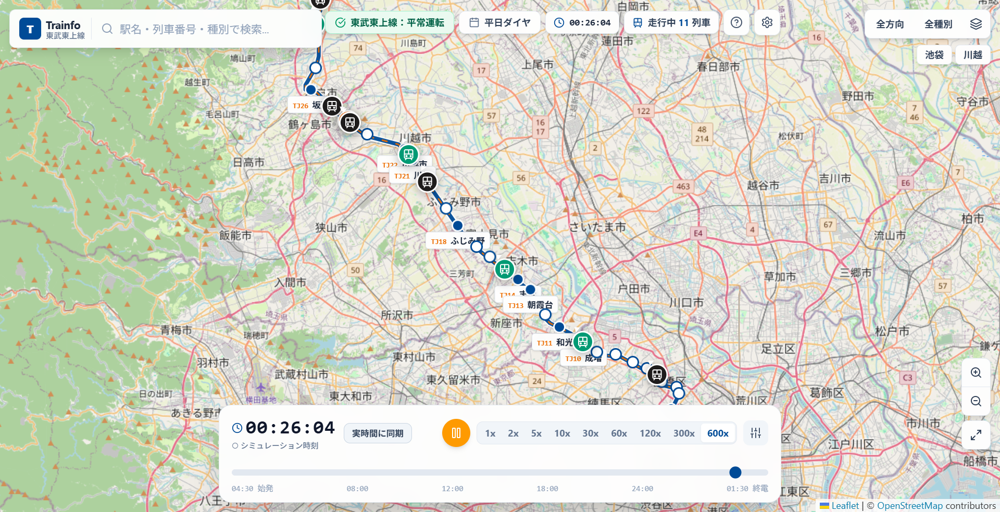

# Trainfo - 首都圏 リアルタイム列車位置＆マルチ路線運行マップ

<div align="center">


### **Trainfo (トレインフォ)**
**東武東上線、JR埼京線・川越線、JR武蔵野線（直通含む）、首都圏新都市鉄道つくばエクスプレスの時刻表に基づき、全列車の現在走行位置・種別・行先・遅延状況をリアルタイムに描画するWebアプリケーション**

[](https://github.com/GenbuHase/Trainfo/actions/workflows/deploy.yml)
[](https://opensource.org/licenses/MIT)
[](https://react.dev/)
[](https://www.typescriptlang.org/)
[](https://vite.dev/)
[](https://tailwindcss.com/)

🌐 **[オンラインデモを体験する (GitHub Pages)](https://GenbuHase.github.io/Trainfo/)**

</div>

---

## 📸 スクリーンショット



---

## 🌟 主な機能

### 1. 🚆 4路線マルチリアルタイム列車位置シミュレーション
- **高精度な実線路追従 & 直通運転の再現**:
  - **東武東上線**（池袋〜寄居：全39駅）
  - **JR埼京線・川越線**（大崎〜大宮〜川越：全24駅）
  - **JR武蔵野線**（府中本町〜西船橋：全26駅）
    - **京葉線直通**: 西船橋 ↔ 東京方面、西船橋 ↔ 海浜幕張方面
    - **中央線直通（むさしの号）**: 八王子 ↔ 立川 ↔ 国立 ↔ 新小平 ↔ 大宮
    - **大宮支線直通（しもうさ号）**: 大宮 ↔ 武蔵浦和 ↔ 南浦和 ↔ 西船橋 ↔ 新習志野・海浜幕張
  - **首都圏新都市鉄道つくばエクスプレス（TX）**（秋葉原〜つくば：全20駅、最高速度130km/h、全線高架・地下構造）
- **広域ターミナル・交差接続ネットワーク**:
  - **南流山駅**: JR武蔵野線（`JM-16`）とつくばエクスプレス（`TX-10`）の交差乗換
  - **武蔵浦和駅**: JR埼京線（`JA-21`）とJR武蔵野線（`JM-26`）の交差
  - **大宮駅**: JR埼京線地下ホーム（`JA-26`）とJR地上ホーム（`JU-07`：むさしの号・しもうさ号発着）
  - **北朝霞駅 / 朝霞台駅**: JR武蔵野線（`JM-28`）と東武東上線（`TJ-13`）の乗換連絡
  - **池袋駅**: 東武東上線（`TJ-01`）とJR埼京線（`JA-12`）
  - **川越駅**: 東武東上線（`TJ-21`）とJR埼京線・川越線（`JA-31`）
- **高精度ダイヤ基盤（Yahoo! 乗換案内データソース）**:
  - 全路線のダイヤを「Yahoo! 乗換案内（路線情報）」から一貫して取得・構築。
  - 各駅停車・快速・特急・直通列車の**各駅「着時刻」「発時刻」および待避停車**をリアルタイムに反映。
- **列車ステータス算出**: リアルタイム走行速度（km/h）、進行方向、駅間進捗率、遅延分数を自動算出。
- **現在時刻同期**: ワンクリックで実時間に同期。

### 2. 🎛️ チェックボックス式 路線セレクター
- **自由なマルチ路線表示切り替え**:
  - `☑ 東武東上線`
  - `☑ JR埼京線・川越線`
  - `☑ JR武蔵野線`
  - `☑ つくばエクスプレス`
- 「全路線同時運行（デフォルト）」または「指定路線の組み合わせ」をチェックボックスで直感的に切り替え。
- 選択状態に合わせて地図カメラが選択路線の全駅をピッタリ包含する最適範囲へスムーズに自動フィット。

### 3. ⏱️ タイムトラベル＆超高速倍速コントローラー
- **連続タイムスライダー**: 始発（04:30）から深夜最終便の入庫完了（翌01:30）まで、シームレスに時間を巻き戻し・早送り。
- **最大600倍速再生**: `1x`, `2x`, `5x`, `10x`, `30x`, `60x`, `120x`, `300x`, `600x` の9段階でダイヤの1日を素早く通覧。
- **ダイヤ種別切替**: 「平日ダイヤ」と「土休日ダイヤ」をワンクリックで切り替え可能。
- **時間帯プリセット**:
  - 🌅 朝ラッシュ（08:00）: 最も過密な運行パターン
  - ☀️ 昼デイタイム（13:00）: 平常運転ダイヤ
  - 🌆 夕ラッシュ（18:30）: 帰宅時間帯の混雑ダイヤ
  - 🌙 深夜終電帯（24:15）: 各方面への最終連絡便

### 4. ⚠️ ダイヤ遅延シミュレーション
- **運行障害シナリオ**:
  - 定刻（平常運転）
  - 全線+5分遅延
  - 全線+15分大幅遅れ
  - ランダム局所遅延（駅や列車ごとに異なるランダムな遅れをシミュレート）
- 運行情報バッジ（平常運転 / 遅延情報）が連動して切り替わります。

### 5. 🎨 公式準拠の運行系統カラーリング & 駅ナンバリングバッジ
- **公式ラインカラー & 列車種別**:
  - **東武東上線**: 普通（黒）、準急（緑）、急行（赤）、快速急行（青）、川越特急（ピンク）、TJライナー（オレンジ）
  - **JR埼京線・川越線**: 各駅停車（埼京グリーン `#00ac9a`）、快速（ブルー `#007ac1`）、通勤快速（レッド `#e60012`）
  - **JR武蔵野線**: 各駅停車（武蔵野オレンジ `#f15a22`）、普通（むさしの号・しもうさ号 `#ea5504`）
  - **つくばエクスプレス**: 普通（グレー `#334155`）、区間快速（水色 `#0099d8`）、通勤快速（オレンジ `#ea5504`）、快速（赤 `#df0011`）
- **マルチライン駅ナンバリングバッジ**:
  - `TJ` (東武東上線): 東武ブルー & オレンジ
  - `JA` (JR埼京線): 埼京エメラルドグリーン
  - `JM` (JR武蔵野線): 武蔵野オレンジ
  - `JE` (JR京葉線直通): 京葉ワインレッド
  - `JC` (JR中央線直通): 中央線オレンジ
  - `JU` (JR宇都宮線・高崎線/大宮地上ホーム): オレンジ
  - `TX` (つくばエクスプレス): TXディープブルー & TXレッド
  - 各路線公式のカラーリングに準拠したデザインでバッジをレンダリング。

### 6. 📋 発車標・列車追従サイドバー & 2段組着発時刻
- **駅情報パネル**:
  - 駅ナンバリングバッジ、駅名（日・英・かな）、設備アイコン、番線情報。
  - **他路線の同名駅切替ボタン**: 南流山駅、川越駅、大宮駅、武蔵浦和駅などの乗換駅で、別路線の駅詳細・時刻表へワンタップで切り替え可能。
  - 電光掲示板スタイルの発車標（先発・次発・次々発）。
  - 各駅の「全列車時刻表モーダル」閲覧機能。
- **列車追尾モード & 停車駅一覧**:
  - 選択した列車を地図中央に自動追尾。
  - **2段組着発時刻表示**: 全停車駅の「〇〇:〇〇着」「〇〇:〇〇発」をリアルタイム表示（待避や通過待ちを正確に可視化）。
- **検索機能**: 駅名・列車番号・行先・種別でのリアルタイムインクリメンタル検索。

---

## 🛠️ 技術スタック

| 分類 | 技術 / ライブラリ |
| :--- | :--- |
| **フロントエンド** | [React 19](https://react.dev/), [TypeScript](https://www.typescriptlang.org/) |
| **ビルドツール** | [Vite 8](https://vite.dev/) (with [Rolldown](https://rolldown.rs/) / [Oxc](https://oxc.rs/)) |
| **スタイリング** | [Tailwind CSS v4](https://tailwindcss.com/), [Lucide React](https://lucide.dev/) |
| **地図描画** | [Leaflet](https://leafletjs.com/), [OpenStreetMap](https://www.openstreetmap.org/) |
| **データソース** | Yahoo! 乗換案内（路線情報）スクレイピング基盤, OpenStreetMap Overpass API |
| **デプロイ・CI/CD** | [GitHub Actions](https://github.com/features/actions), [GitHub Pages](https://pages.github.com/) |

---

## 📂 ディレクトリ構成

```text
Trainfo/
├── docs/                               # ドキュメント・アセット
│   ├── ROUTE_EXPANSION_PLAYBOOK.md     # 路線追加完全手順書・設計ガイド
│   ├── ODPT_INTEGRATION_KNOWLEDGE.md   # ODPT活用ナレッジ＆将来設計ガイド
│   ├── logo.svg
│   └── screenshot.png
├── scripts/                            # データ生成・スクレイピングパイプライン
│   ├── runYahooImporter.cjs            # Yahoo! 乗換案内 共通インポーター CLI
│   ├── common/
│   │   └── yahoo/                      # 共通データ生成基盤
│   │       ├── YahooClient.cjs         # HTTPクライアント & キャッシュ制御
│   │       ├── YahooStationTimetableScraper.cjs # 駅時刻表スクレイパー
│   │       ├── YahooTrainDetailScraper.cjs     # 列車詳細（着発時刻）スクレイパー
│   │       └── YahooTimetableBuilder.cjs       # ダイヤ合成 & 汎用通過・秒補間
│   └── lines/
│       ├── tojo/                       # 東武東上線 設定（config.cjs）
│       ├── saikyo/                     # JR埼京線・川越線 設定（config.cjs）
│       ├── musashino/                  # JR武蔵野線 設定（config.cjs）
│       └── tsukuba_express/            # つくばエクスプレス 設定（config.cjs）
├── src/
│   ├── components/
│   │   ├── Common/                     # 駅ナンバリング・種別バッジ（Badges.tsx）
│   │   ├── Controls/                   # タイムスライダー・各種操作パネル
│   │   ├── Header/                     # 路線フィルター・検索バー
│   │   ├── Map/                        # Leaflet 地図描画・マーカー・線路ポリライン
│   │   ├── Modals/                     # 時刻表・API設定・使い方モーダル
│   │   └── Sidebar/                    # 駅・列車詳細パネル・発車標
│   ├── data/
│   │   ├── lines/
│   │   │   ├── tojo/                   # 東武東上線モジュール
│   │   │   ├── saikyo/                 # JR埼京線・川越線モジュール
│   │   │   ├── musashino/              # JR武蔵野線モジュール（直通区間含む）
│   │   │   └── tsukuba_express/        # つくばエクスプレスモジュール
│   │   ├── linesRegistry.ts            # プラグイン型 路線統合レジストリ
│   │   ├── stations.ts                 # 統合駅データ
│   │   ├── trackGeometry.ts            # 統合軌道・補間計算エンジン
│   │   └── timetableData.ts            # 統合時刻表ユーティリティ
│   ├── services/
│   │   └── trainSimulation.ts          # リアルタイム列車走行シミュレーションエンジン
│   ├── types/                          # TypeScript 型定義 (LineDefinition等)
│   ├── App.tsx                         # メインアプリケーションコンポーネント
│   └── main.tsx                        # エントリーポイント
├── package.json
└── vite.config.ts
```

---

## 📖 開発・設計ドキュメント

- 👉 [**Trainfo 路線追加完全プレイブック（docs/ROUTE_EXPANSION_PLAYBOOK.md）**](docs/ROUTE_EXPANSION_PLAYBOOK.md): 新路線追加の手順、インポーター設定、チェックリスト
- 👉 [**ODPT活用ナレッジ＆将来設計ガイド（docs/ODPT_INTEGRATION_KNOWLEDGE.md）**](docs/ODPT_INTEGRATION_KNOWLEDGE.md): 公共交通オープンデータの活用可能性と推奨アーキテクチャ


---

## 🚀 ローカルでの動かし方

### 前提条件
- [Node.js](https://nodejs.org/) (v20.x 以上推奨)
- npm (v10.x 以上)

### 1. リポジトリのクローン
```bash
git clone https://github.com/GenbuHase/Trainfo.git
cd Trainfo
```

### 2. 依存パッケージのインストール
```bash
npm install
```

### 3. 開発サーバーの起動
```bash
npm run dev
```
ブラウザで `http://localhost:5173/` を開くとアプリケーションが起動します。

### 4. ダイヤ・時刻表データの再取得・ビルド（任意）
```bash
# 例: つくばエクスプレスのダイヤをYahoo!から再生成
node scripts/runYahooImporter.cjs --line tsukuba_express
```

### 5. プロダクションビルド＆プレビュー
```bash
npm run build
npm run preview
```

---

## 🚢 デプロイ (GitHub Pages)

### GitHub Actions による自動デプロイ（推奨）
1. 本リポジトリの **Settings** > **Pages** を開きます。
2. **Build and deployment** の **Source** を **「GitHub Actions」** に設定します。
3. `master` または `main` ブランチにコミットをプッシュすると、自動的にビルド＆デプロイが実行されます。

---

## ⚠️ 免責事項・データ出典

- **免責事項**:  
  本アプリケーションは個人が学習・研究目的で制作した非公式のファンメイドシミュレータです。**東武鉄道株式会社、東日本旅客鉄道株式会社（JR東日本）、首都圏新都市鉄道株式会社、LINEヤフー株式会社および関係各社とは一切関係ありません**。  
  本アプリに表示される列車の運行状況・時刻・位置情報はシミュレーション値であり、実際の運行管理システムや運行ダイヤとは差異が生じる場合があります。
- **データ出典**:  
  - 時刻表・運行情報: Yahoo! 乗換案内（路線情報）
  - 地図データ: © [OpenStreetMap](https://www.openstreetmap.org/copyright) contributors

---

## 📄 ライセンス

本プロジェクトは [MIT License](LICENSE) のもとで公開されています。

Copyright (c) 2026 長谷 玄武 (Genbu Hase)
