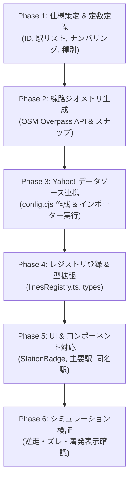

# Trainfo 路線追加完全プレイブック（標準手順書 & チェックリスト）

本ドキュメントは、Trainfo に新しい路線を追加する際の標準ワークフロー、データ構造、実装手順、およびハマりどころの防止策をまとめた完全マニュアルです。  
これまでの**東武東上線**、**JR埼京線・川越線**、**JR武蔵野線**、**首都圏新都市鉄道つくばエクスプレス（TX）**、**JR中央線**・**JR中央本線**、**JR篠ノ井線**、ならびに**JR大糸線（JR東日本 大糸線 / JR西日本 大糸線）**の実装、および**Yahoo! 乗換案内データソース共通基盤**への完全移行で培われた知見を集約しています。

---

## 1. 路線拡張アーキテクチャ概要

Trainfo は、複数事業者の路線が同一マップ・同一シミュレーション基盤上で協調動作するマルチライン構造を採用しています。  
各路線は `src/data/lines/<lineId>/` 配下に自己完結したモジュールとして実装され、`src/data/linesRegistry.ts` に登録することで統合されます。  
また、時刻表・ダイヤ生成パイプラインは `scripts/common/yahoo/` の汎用基盤により、路線ごとの設定ファイル（`scripts/lines/<lineId>/config.cjs`）のみで完結します。

```text
Trainfo/
├── docs/
│   └── ROUTE_EXPANSION_PLAYBOOK.md     # 本手順書
├── scripts/
│   ├── runYahooImporter.cjs            # Yahoo! 乗換案内 共通インポーター CLI
│   ├── common/
│   │   └── yahoo/                      # 共通データ生成基盤
│   │       ├── YahooClient.cjs         # HTTPクライアント & キャッシュ制御
│   │       ├── YahooStationTimetableScraper.cjs # 駅時刻表スクレイパー
│   │       ├── YahooTrainDetailScraper.cjs     # 列車詳細（着発時刻）スクレイパー
│   │       └── YahooTimetableBuilder.cjs       # ダイヤ合成 & 汎用通過・秒補間
│   └── lines/
│       └── <lineId>/
│           └── config.cjs              # 路線固有のスクレイパー・ダイヤ設定
├── src/
│   ├── types/index.ts                  # LineId, TrainTypeKey などの型定義
│   ├── data/
│   │   ├── linesRegistry.ts            # 全路線の集約レジストリ
│   │   └── lines/
│   │       └── <lineId>/               # 各路線のデータモジュール
│   │           ├── index.ts            # LineDefinition（路線メタデータ統合）
│   │           ├── stations.ts         # 駅メタデータ（Station[]）
│   │           ├── trackGeometry.ts    # 線路幾何データ（TrackSegment[]）
│   │           ├── trainTypes.ts       # 列車種別設定（TrainTypeConfig）
│   │           ├── stationTimetables.json # 各駅時刻表（StationTimetableStore）
│   │           └── globalTimetable.json   # 全列車ダイヤ（TimetableTrip[]）
│   └── components/
│       ├── Common/Badges.tsx           # 駅ナンバリング・種別バッジ
│       └── Map/TrainMap.tsx            # マップ描画・主要駅定義
```

---

## 2. 路線追加の全6フェーズ・ワークフロー



---

### Phase 1: 路線・駅の基本仕様策定

1. **基本メタデータの決定**:
   * `lineId`: 英小文字のスネークケース（例: `tsukuba_express`, `keihin_tohoku`, `yurakucho`）
   * `lineColor`: 公式ラインカラー（HEX値）
   * `accentColor`: アクセント/速達種別カラー
   * `defaultBounds`: 初期表示バウンディングボックス（南西 `[lat, lng]`, 北東 `[lat, lng]`）
   * `directionNames`: 上り/下りの方向名（正式名称・短縮名称）

2. **駅メタデータの作成 (`stations.ts`)**:
   * 駅ナンバリング: 公式プレフィックス（例: `TX-01`）と連番。
   * 乗換路線（`transfers`）、番線表記（`platforms`）、バリアフリー設備（`facilities`）。
   * 停車種別（`stoppingTypes`）: **【重要】各駅に停車する種別キーの配列を正確に定義。これがダイヤ補間における通過・停車の Single Source of Truth となります。**
   * 緯度経度（`lat`, `lng`）: 国土地理院またはOSMの駅ノードから高精度に取得。

3. **種別定義の作成 (`trainTypes.ts`)**:
   * 各種別の表示名、短縮名、背景色（`bgColor`）、文字色（`textColor`）、枠線色（`borderColor`）。

---

### Phase 2: 線路ジオメトリの構築 (`trackGeometry.ts`)

列車が地図上を滑らかに走行するためのポリラインを作成します。

1. **OSM Overpass API による線路データ取得**:
   * 対象路線のリレーション（Relation）またはウェイ（Way）を取得。
   * Overpass Turbo クエリ例:
     ```overpassql
     [out:json][timeout:60];
     relation["route"="train"]["name"~"つくばエクスプレス"];
     (._;>>;);
     out body;
     ```
2. **駅座標へのスナップ (`snapStation`)**:
   * 各駅の緯度経度に一番近い線路ノードを検出し、駅間セグメントに分割。
   * **注意点**: 複線・複々線・待避線が混在する場合、本線の滑らかな連続線を選択する。
3. **セグメントの出力形式**:
   ```typescript
   export interface TrackSegment {
     fromStationId: string;
     toStationId: string;
     fromName: string;
     toName: string;
     coordinates: [number, number][]; // [lat, lng] の連続配列
   }
   ```

---

### Phase 3: Yahoo! データソース連携 & ダイヤ生成 (`scripts/common/yahoo/`)

Trainfo では、高精度な「**Yahoo! 乗換案内（路線情報）データソース共通基盤**」を標準採用しています。  
駅探方式の課題であった「終着駅の到着時刻欠落」や「途中駅待避・緩急接続での長時間停車（着時刻と発時刻の差）」を完全な実データとして取得可能です。

#### 1. 路線設定ファイルの作成 (`scripts/lines/<lineId>/config.cjs`)
新規路線用の設定ファイルを1つ作成するだけで、ダイヤ生成の準備が完了します。

```javascript
// scripts/lines/<lineId>/config.cjs
module.exports = {
  lineId: 'tsukuba_express',
  name: '首都圏新都市鉄道つくばエクスプレス',
  stationsFilePath: 'src/data/lines/tsukuba_express/stations.ts',
  outputPaths: {
    stationTimetables: 'src/data/lines/tsukuba_express/stationTimetables.json',
    globalTimetable: 'src/data/lines/tsukuba_express/globalTimetable.json',
  },
  // Yahoo! 路線情報における駅IDと上り/下りのグループID
  stations: [
    { id: 'TX-01', name: '秋葉原', yahooStationId: '22492', inGroupId: null, outGroupId: '6921' },
    { id: 'TX-02', name: '新御徒町', yahooStationId: '29336', inGroupId: '6920', outGroupId: '6921' },
    // ...
    { id: 'TX-20', name: 'つくば', yahooStationId: '29410', inGroupId: '6920', outGroupId: null },
  ],
  // 駅名表記ゆれの正規化
  stationNameAliases: {
    '浅草(ＴＸ)': '浅草',
    '万博記念公園(茨城県)': '万博記念公園',
  },
  // Yahoo! 種別名から TrainTypeKey へのマッピング
  trainTypeMap: {
    '普通': 'local',
    '区間快速': 'semi_rapid',
    '通勤快速': 'commuter_rapid',
    '快速': 'rapid',
    '特急': 'limitedExp',
  },
  defaultCars: 6,
  // 通過駅の秒補間用 基準駅間秒数
  baseSectionSeconds: {
    1: 120, // TX-01 -> TX-02
    2: 120, // TX-02 -> TX-03
    // ...
  },
  // 【オプション】分岐直通路線用設定（武蔵野線など）
  // directStops: true, // 停車駅リストを直接トリップのstopsとして使用
  // buildStationTimetablesFromTrips: true, // トリップから駅発車標を集約
  // junctionPassingRules: [{ fromId: 'JU-07', toId: 'JM-25', viaIds: ['JM-26'] }],
};
```

> **Yahoo! IDの調べ方**:
> 1. `https://transit.yahoo.co.jp/timetable/` で対象路線の駅時刻表ページを開く。
> 2. URL 例: `https://transit.yahoo.co.jp/timetable/22492/6921?kind=1`
>    - `22492` が `yahooStationId`
>    - `6921` が その方向（下り等）のグループID（`outGroupId`）
>    - 逆方向ページの `6920` が上りのグループID（`inGroupId`）

#### 2. インポーター CLI の実行
```bash
node scripts/runYahooImporter.cjs --line <lineId>
```

**パイプラインの自動実行ステップ**:
1. **Step 1: 駅時刻表スクレイピング**: 全駅の平日（`kind=1`）・土休日（`kind=4`）発車標を収集し `stationTimetables.json` を出力。
2. **Step 2: 列車詳細スクレイピング**: ユニーク列車（`${dayKey}_${trainId}`）の詳細ページから全停車駅の**着時刻・発時刻・終着駅着時刻**を完全収集。
3. **Step 3: ダイヤ合成 & 汎用通過・秒補間**: `stations.ts` の `stoppingTypes` を参照して通過駅を自動特定し、停車/通過を考慮した線形秒補間を行って `globalTimetable.json` を生成。

---

### Phase 4: レジストリ登録 & 型拡張

1. **`src/types/index.ts`**:
   * `LineId` 共用体に新しい路線IDを追加。
     ```typescript
     export type LineId = 'tojo' | 'saikyo' | 'musashino' | 'tsukuba_express';
     ```
   * 必要に応じて `TrainTypeKey` に新路線の固有種別を追加。
2. **`src/data/lines/<lineId>/index.ts`**:
   * `LineDefinition` オブジェクトをエクスポート。
3. **`src/data/linesRegistry.ts`**:
   * `LINES_REGISTRY` に新路線を追加。

---

### Phase 5: UI & コンポーネント対応

1. **駅ナンバリングバッジの配色追加 ([`Badges.tsx`](file:///c:/Users/Genbu/GitHub/github.com/GenbuHase/Trainfo/src/components/Common/Badges.tsx))**:
   * `STATION_BADGE_COLORS` に新路線のプレフィックス（TX等）を登録。
     ```typescript
     TX: {
       borderColor: '#003893',
       prefixColor: '#df0011',
       numColor: '#003893',
     },
     ```
2. **主要駅ハイライト登録 ([`TrainMap.tsx`](file:///c:/Users/Genbu/GitHub/github.com/GenbuHase/Trainfo/src/components/Map/TrainMap.tsx))**:
   * ズームアウト時にも駅名を表示する主要駅ID（ターミナル駅、快速停車駅、乗換駅）を `isMajor` 配列に追加。
3. **他路線との同名駅リンク ([`StationDetail.tsx`](file:///c:/Users/Genbu/GitHub/github.com/GenbuHase/Trainfo/src/components/Sidebar/StationDetail.tsx))**:
   * 駅名（`station.name`）が一致する駅同士は自動的に相互切り替えボタンが表示されます。
   * 乗換駅の駅名表記揺れがないか確認（例: 武蔵野線とTXの「南流山」など）。

---

### Phase 6: シミュレーション検証 & テスト

* [ ] `npm run build` を実行し、TypeScriptの型エラーやJSONパースエラーがゼロであることを確認。
* [ ] 軌道セグメントの点間距離・逆走監査: セグメント内に異常な大ジャンプ（急激な折れ曲がり・往復トゲ）がないか、全駅座標と軌道端点の乖離が許容範囲（数十m以内）に収まっているかを確認。
* [ ] 種別フィルターの検証: 「全種別」「優等」「普通/各停」ボタンを切り替え、普通（regular）や各停（local）が適切なフィルター区分で表示/非表示されるか確認。
* [ ] 列車シミュレータを起動し、早送り（10x/30x）で以下の挙動をチェック：
  * 列車の瞬間移動や不自然なジャンプがないか。
  * 駅間で急激なUターン（行って帰る挙動）が発生していないか。
  * 始発駅での発車、終着駅での消滅がスムーズに行われるか。
* [ ] 駅発車標モーダル（TimetableModal）を開き、発車時刻・行先・種別が正常に並んでいるか確認。
* [ ] 列車詳細サイドバー（TrainDetail）を開き、停車駅一覧が「〇〇:〇〇着」「〇〇:〇〇発」の2段組で正しく表示されるか確認。

---

## 3. 重要教訓・ハマりどころ防止策（設計標準）

> [!IMPORTANT]
> 過去の実装およびYahoo!データ移行で解決された以下の知見を必ず遵守してください。

### 1. ダイヤ補間における stoppingTypes 駆動（Single Source of Truth）
* **事象**: 速達列車（快速や急行）の補間ロジック内に駅番号や停車ルールを個別ハードコードすると、路線拡張時やダイヤ改正時に不整合・保守不能が発生する。
* **防止策**: 停車/通過判定は必ず `stations.ts` の `station.stoppingTypes.includes(trainType)` のみで行う。

### 2. Yahoo! 路線情報における平日/休日列車ID衝突の回避
* **事象**: Yahoo! の内部データにおいて、平日（`kind=1`）と土休日（`kind=4`）で同一の `trainId`（例: `44618`）が再利用される場合がある。
* **防止策**: ユニーク列車キーおよびキャッシュファイル名は必ず **`${dayKey}_${trainId}`**（複合キー）で管理する。

### 3. 種別解決の最長一致スキャン（Longest-Match Scan）
* **事象**: 「普通 むさしの号」を単純な部分一致で判定すると、「普通」に誤判定されて「むさしの号」固有の設定が失われる。
* **防止策**: 種別名のマッチングはキー文字列の長さが長い順（降順）に走査し、より具体的な種別名を優先して解決する。

### 4. 直通先種別の自社線内フォールバック
* **事象**: 東武東上線に乗り入れる地下鉄直通列車（副都心線内「通勤急行」等）が、東上線内の各駅停車区間で「通過」と誤認される。
* **防止策**: 路線定義に存在しない他社線種別が渡された場合、あるいは自社線内で全駅停車となる区間では、安全に自社線内の標準種別（`local` 等）へフォールバックさせる。

### 5. 短絡線・特急・臨時列車の通過駅補間 (`junctionPassingRules` / `directStops`)
* **事象**: 武蔵野線の大宮支線（大宮 ↔ 武蔵浦和/南浦和）や貨物線経由の特急（鎌倉号、川越号等）で、中間の信号場や短絡線の線路セグメントが飛び越えられ、列車がワープする。
* **防止策**: 
  * 停車駅リストに存在しないが物理的に経由する駅（例: 大宮から南浦和へ向かう際の武蔵浦和）を `junctionPassingRules` で通過駅（`isPassing: true`）として中間補間する。
  * 特殊直通路線では `directStops: true` を指定し、実停車駅シーケンスから線路追従トリップを組み立てる。

### 6. 発着番線と駅ナンバリングの実態整合（大宮駅問題）
* **事象**: 同一駅名であっても発着ホームが異なる場合（大宮駅地上ホーム発着のむさしの号・しもうさ号に対して埼京線地下ホーム `JA-26` を流用したケース）、ナンバリングや案内が実態と乖離する。
* **防止策**: 列車が実際に発着するホームの所属路線ナンバリング（大宮地上ホームなら `JU-07`）を採用する。

### 7. 直通列車の路線間重複防止と駅案内・シミュレーションの調和（むさしの号・直通列車問題）
* **事象**: 複数路線を跨ぐ直通系統（大宮〜武蔵野線〜中央線・八王子を直通する「むさしの号」など）において、駅発車標のために両路線でデータを収集すると、両路線選択時に同一線路上に2台の同一列車マーカーが重なって描画・走行してしまう。
* **防止策（ベストプラクティス）**:
  * **データ層**: 各路線の駅発車標（八王子・立川等の時刻表モーダル）で正常に案内できるよう、双方の時刻表データには残す。
  * **シミュレーション層 (`trainSimulation.ts`)**: `calculateActiveTrains` において、「同一列車番号 かつ 共通の駅IDを含む」アクティブ列車を自動検出し、停車駅数が多い方（全線通し運行トリップ）を優先採用して部分運行トリップを自動重複除外する。これにより、単独路線選択時は各路線で走り、全路線選択時は二重重なりなしに通し運行として1台のみが走行する。

### 8. 長大路線のパフォーマンス最適化と系統分離（中央線と中央本線の表示路線分離）
* **事象**: 東京近郊過密区間（JCナンバリング JC-01〜JC-24）から山梨・長野中距離区間（JC-25〜JC-32, CO-33〜CO-61）のように、境界駅（高尾）を境に運行頻度や編成両数が大きく異なる長大路線を単一モジュールで読み込むと、常時60駅超・1,600本以上のダイヤ計算が発生し、レンダリングやシミュレーションのパフォーマンスに影響を与える。
* **防止策（ベストプラクティス）**:
  * **表示路線の系統分離**: JR東日本の公式運行情報案内およびYahoo!路線情報の路線区分（東京〜高尾: 1090/1091 / 高尾〜塩尻: 1070/1071）に準拠し、「JR中央線（`chuo`）」と「JR中央本線（`chuo_main`）」の2つの独立モジュールとして分離。ユーザーは必要な路線のみを選択して超高速に閲覧可能。
  * **境界駅（高尾駅 JC-24）での接続**:
    * 高尾駅を両路線の接続ターミナル駅とし、相互の乗換案内（`transfers`）およびサイドバーでの相互切替をサポート。
    * **直通メタデータによる自動ハンドオーバー**: 直通列車（特急あずさ・かいじ、大月行快速等）は境界駅で区間分割し、`throughTripId`（直通先トリップID）および `throughLineId`（直通先路線ID）を付与する。`App.tsx` は特定路線の `if` 分岐や駅名リストを持たず、この共通メタデータに基づいてシームレスに追尾を引き継ぎ、相手路線を未選択時でも自動選択する。
    * 直通列車の行先表示は `customDestination` を付与し、境界手前でも最終行先（例: 大月、甲府、松本、東京、新宿）を正常に表示。始発駅は `customOrigin` で本来の始発駅（例: 塩尻、松本、甲府）を表示。
    * 高尾駅の発車標データは上り（東京方面）と下り（甲府方面）を `getCombinedStationTimetables` で重複なく時刻順に自動マージ。
  * **広域ズーム主要駅フラグ (`isMajor`)**: 各駅定義（`stations.ts`）に `isMajor: true` を持たせることで、地図コンポーネント側に駅IDの直書き配列を持たせず、路線非依存でズームアウト時の一括表示を制御可能。
  * **バッジコンポーネントの柔軟性**: `Badges.tsx` のプレフィックス設定に `CO`（中央東線ブルー `#0072bc`）と `JC`（オレンジ `#f15a22`）を両方保持し、公式ナンバリング記号に完全対応。

### 9. 「普通」と「各駅停車」の種別分離とフィルタリング設計（regular vs local問題）
* **事象**: 中距離電車を走らせる路線（中央本線、宇都宮線、高崎線、常磐線など）では、案内上の正式種別が「各駅停車」ではなく「普通」である。内部キーとして `regular`（普通）と `local`（各駅停車）を区分した場合、全駅停車時の種別保護ロジックや地図上の種別フィルターで考慮されていないと、「普通」が各停に勝手に上書きされたり、種別フィルターで「優等」に誤分類される。
* **防止策**:
  * **種別マッピングの明確化**: `trainTypeMap` で `'普通': 'regular'`, `'各駅停車': 'local'` を明確に分離する。
  * **全駅停車時上書き保護**: `YahooTimetableBuilder.cjs` の各停化ロジックにおいて、`regular` を `local` に上書きしないよう除外ガード（`trainType !== 'regular'`）を施す。
  * **種別フィルター対応 (`TrainMap.tsx`)**: 地図画面の種別絞り込みロジックにおいて、各停系判定条件に `train.trainType === 'regular'` を含めることで、「普通/各停」選択時に普通列車が正常に表示され、「優等」選択時に確実に除外されるようにする。

### 10. OSMリレーションのウェイ順序狂いによる「往復トゲ（ヒゲ状パス）」の検出と解消
* **事象**: OSMのリレーションにおいて、橋梁や分岐などの短いウェイが本来の位置より後ろ（または手前）に誤って登録されている場合がある（中央東線の初狩駅手前橋梁など）。メンバー順に盲目的に連結すると、駅ホームまで進んだ後に数百メートル手前へワープして戻る「V字型のトゲ（ヒゲ状逆戻りパス）」が発生する。
* **防止策**:
  * **点間距離監査**: セグメント生成後にスクリプトを用いて、連続する点同士の距離（dLat/dLng）を走査し、トンネルや長い直線以外の不自然な大ジャンプ（300m以上かつ手前方向への逆戻り）を自動検出する。
  * **正しいウェイ連結**: リレーション内の配列順序に依存せず、直前の端点と最も距離が近いウェイ（始端・終端の反転を考慮）を繋ぐことで、余計なワープや重複を除去する。

### 11. 旧スイッチバック線・側線・駅舎と現行本線ホームの座標乖離（初狩駅問題）
* **事象**: 歴史のある駅（スイッチバック遺構や広い側線を持つ駅）では、代表座標が旧駅舎や引き込み線に置かれており、現在の本線ホームから数百メートル離れている場合がある。これにより、本線セグメントが駅手前で不自然に分断され、駅ピンも線路から外れてしまう。
* **防止策**:
  * **駅座標の選定**: 駅座標（`stations.ts`）は必ず現行の「旅客本線ホーム」のノード座標（Overpassの `railway=station` かつ本線上）を採用する。
  * **全駅整合性テスト**: セグメント生成時に、各駅座標と対応する軌道セグメントの端点（始端・終端）との距離（dStart, dEnd）を検証し、全駅で乖離が許容範囲（ホーム長相当の数十m以内）に収まっているかを自動テストする。

### 12. 長大路線の終着駅・他社線直通境界の決定基準（塩尻駅・篠ノ井線問題）
* **事象**: 特急（あずさ・しなの）等が他社線や他系統へ直通する長大路線において、どこまでを1つの路線モジュールとして定義するかの境界決定。
* **防止策**:
  * **正式な線路名称・管轄基準**: JRの正式な線路名称および支社管轄（中央東線は塩尻まで、塩尻〜松本は篠ノ井線）に準拠し、路線の終着駅を明確に決定する。
  * **終着駅のグループID設定**: 終着駅（塩尻駅）では下りのYahoo路線グループIDを `outGroupId: null` とし、他路線（篠ノ井線、中央西線）への乗換路線設定（`transfers`）を行って、単一線路シミュレーションとしての完結性と整合性を保つ。

### 13. 他路線直通・全線通し運行区間の統合と優等列車リレーション活用（篠ノ井線・信越本線区間）
* **事象**: 正式な線路区間（篠ノ井線: 塩尻〜篠ノ井）と実際の運行体系（ほぼ全列車が信越本線に直通して長野駅まで運行）が乖離している場合、路線モジュールをどこまで定義すべきか、またOSMにおいて複数路線に跨る本線連続軌道をどう抽出するか。
* **防止策**:
  * **運行実態に合わせた直通区間の統合**: 埼京線・川越線（大崎〜大宮〜川越）と同様、篠ノ井線も利用者の目的地である長野駅まで（塩尻〜篠ノ井〜長野 全19駅）を1つの路線モジュールとして定義する。
  * **通し優等列車リレーションの活用**: 単一路線リレーション（篠ノ井線）では直通区間（篠ノ井〜長野）が含まれないが、全線を直通する特急列車（例: 特急「しなの」名古屋〜長野 Relation `1983032`）のリレーションを活用することで、複数路線に跨る本線軌道を一括で高精度に取得できる。
  * **他路線乗り入れ区間のYahoo! GID切替**: 境界駅（篠ノ井駅）を境に、上り方面は `1321`（篠ノ井線）と `760`（信越本線）、下り方面は `1320`（篠ノ井線）と `761`（信越本線長野方面）へ駅単位でグループIDを正確に切り替える。
  * **OSMリレーション欠落ウェイの補完**: リレーションから長大トンネルや橋梁などの短いウェイが欠落して点間ジャンプが発生する場合、途切れた端点ノードの接続wayをOSM API（`/node/{id}/ways.json`）で照会し、欠落ウェイを特定・補完して連続ポリラインを復元する。

### 14. 運行事業者境界（JR東日本/JR西日本）による路線モジュールの系統分離（大糸線問題）
* **事象**: 同一名称の「JR大糸線」であっても、JR東日本管轄（松本〜南小谷: 直流電化、特急あずさ直通、短編成〜長大12両編成）とJR西日本管轄（南小谷〜糸魚川: 非電化、単行気動車キハ120形、運行本数極小）では、電化方式・運行会社・車両運用・ダイヤ構造が南小谷駅で完全に独立・分断されている。
* **防止策**:
  * **2系統分離設計**: `oito_east`（JR東日本 大糸線、ラインカラー: パープル `#8a579e`）と `oito_west`（JR西日本 大糸線、ラインカラー: JR西日本ブルー `#0067b8`）の2つの独立モジュールとして定義。
  * **境界駅（南小谷駅）での接続**:
    * 南小谷駅を両路線の接続境界とし、`OE-33`（東日本）と `OW-01`（西日本）を同名駅として自動相互リンク。
    * 東日本側下りの終着、西日本側上りの終着としてそれぞれ `outGroupId: null` / `inGroupId: null` を設定。
  * **ナンバリング体系の整合**: 東日本区間は松本から南小谷へ連番 `OE-01`〜`OE-33`、西日本区間は南小谷から糸魚川へ `OW-01`〜`OW-09` を付与し、各社の案内体系と直感的な駅順ソートを両立。

### 15. トポロジカル経路探索（BFS/Dijkstra）による単線・山間部線路の完全チェーン
* **事象**: 単線・山間部（渓谷・トンネル連続区間や交換可能駅の待避線）において、端点間距離の最近傍探索のみでウェイを連結しようとすると、短い橋梁やトンネルウェイが飛び越えられたり、待避線側のノードに吸い寄せられて本線が逆戻りする「トゲ」や「不自然な大ステップ」が発生する。
* **防止策**:
  * **トポロジカルグラフの構築**: 抽出したウェイ群からノード隣接グラフを構築し、起点駅ノードから終点駅ノードへの最短パス探索（BFSまたはDijkstra）を行う。
  * **幾何飛び越えの根絶**: OSMのノード接続関係（トポロジー）に100%準拠してウェイを辿ることで、飛び越え・順序の狂い・待避線の逆戻りを一切排除した、完全無欠の1本の本線軌道を復元できる。

---

## 4. 新路線追加用 設定ファイル・テンプレート

新規路線を追加する際は、以下のひな型をコピーして `scripts/lines/<lineId>/config.cjs` を作成してください。

```javascript
// scripts/lines/<lineId>/config.cjs
module.exports = {
  lineId: '<lineId>',
  name: '<正式路線名>',
  stationsFilePath: 'src/data/lines/<lineId>/stations.ts',
  outputPaths: {
    stationTimetables: 'src/data/lines/<lineId>/stationTimetables.json',
    globalTimetable: 'src/data/lines/<lineId>/globalTimetable.json',
  },
  stations: [
    // Yahoo! 路線情報の各駅ID・グループIDを記述
    { id: '<PREFIX>-01', name: '<駅名1>', yahooStationId: 'xxxxx', inGroupId: null, outGroupId: 'yyyy' },
    { id: '<PREFIX>-02', name: '<駅名2>', yahooStationId: 'xxxxx', inGroupId: 'zzzz', outGroupId: 'yyyy' },
  ],
  stationNameAliases: {
    // Yahoo! 特有の駅名（例: "駅名(都道府県)"）の表記ゆれ吸収
  },
  trainTypeMap: {
    '普通': 'local',
    '各駅停車': 'local',
    '快速': 'rapid',
    '急行': 'express',
  },
  defaultCars: 10,
  baseSectionSeconds: {
    // 駅間標準秒数（1: 駅1->駅2, 2: 駅2->駅3, ...）
    1: 120,
    2: 180,
  },
};
```
