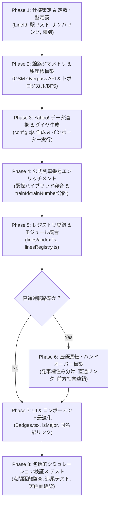
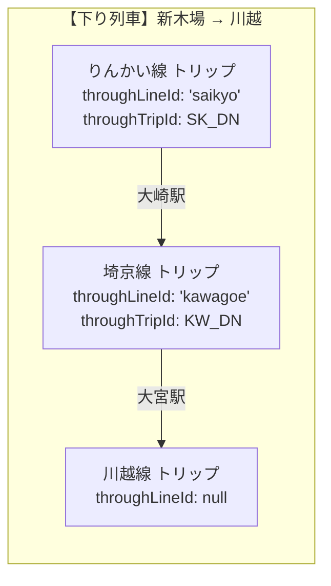
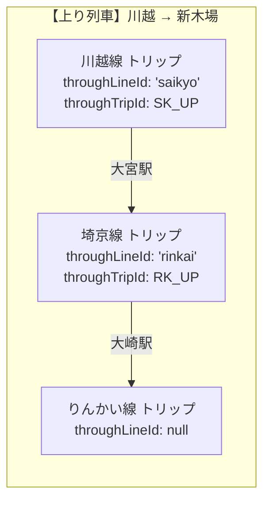

# Trainfo 路線追加完全プレイブック（標準手順書 & チェックリスト）

本ドキュメントは、Trainfo に新しい路線を追加する際の標準ワークフロー、データ構造、実装手順、およびハマりどころの防止策をまとめた完全マニュアルです。  
これまでの**東武東上線**、**東武越生線**、**JR埼京線**・**JR川越線（大宮〜高麗川全線）**、**東京臨海高速鉄道りんかい線**、**東京メトロ有楽町線**・**東京メトロ副都心線**、**西武池袋線**・**西武有楽町線**、**秩父鉄道秩父本線**、**JR八高線**、**JR武蔵野線**、**首都圏新都市鉄道つくばエクスプレス（TX）**、**JR中央線**・**JR中央本線**、**JR青梅線**、**JR五日市線**、**JR篠ノ井線**、ならびに**JR大糸線（JR東日本 大糸線 / JR西日本 大糸線）**の実装、および**Yahoo! 乗換案内データソース共通基盤**への完全移行で培われた知見を集約しています。

---

## 1. 路線拡張アーキテクチャ概要

Trainfo は、複数事業者の路線が同一マップ・同一シミュレーション基盤上で協調動作するマルチライン構造を採用しています。  
各路線は `src/data/lines/<lineId>/` 配下に自己完結したモジュールとして実装され、`src/data/linesRegistry.ts` に登録することで統合されます。  
また、時刻表・ダイヤ生成パイプラインは `scripts/common/yahoo/` の汎用基盤により、路線ごとの設定ファイル（`scripts/lines/<lineId>/config.cjs`）のみで完結します。

```text
Trainfo/
├── docs/
│   └── ROUTE_EXPANSION_PLAYBOOK.md     # 本手順書
├── scripts/
│   ├── runYahooImporter.cjs            # Yahoo! 乗換案内 共通インポーター CLI
│   ├── enrich_train_numbers.cjs        # 駅探ハイブリッド突合・公式列車番号エンリッチメント
│   ├── common/
│   │   └── yahoo/                      # 共通データ生成基盤
│   │       ├── YahooClient.cjs         # HTTPクライアント & キャッシュ制御
│   │       ├── YahooStationTimetableScraper.cjs # 駅時刻表スクレイパー
│   │       ├── YahooTrainDetailScraper.cjs     # 列車詳細（着発時刻）スクレイパー
│   │       └── YahooTimetableBuilder.cjs       # ダイヤ合成 & 汎用通過・秒補間
│   ├── lines/
│   │   └── <lineId>/
│   │       └── config.cjs              # 路線固有のスクレイパー・ダイヤ設定
│   ├── link_<lineA>_<lineB>.cjs        # 直通運転メタデータ自動付与スクリプト（直通路線用）
│   └── test_<boundary>_handover.ts     # 境界駅・追尾ハンドオーバー検証テスト
├── src/
│   ├── types/index.ts                  # LineId, TrainTypeKey などの型定義
│   ├── data/
│   │   ├── linesRegistry.ts            # 全路線の集約レジストリ・事業者表示順序
│   │   └── lines/
│   │       └── <lineId>/               # 各路線のデータモジュール
│   │           ├── index.ts            # LineDefinition（路線メタデータ統合）
│   │           ├── stations.ts         # 駅メタデータ（Station[]）
│   │           ├── trackGeometry.ts    # 線路幾何データ（TrackSegment[]）
│   │           ├── trainTypes.ts       # 列車種別設定（TrainTypeConfig）
│   │           ├── stationTimetables.json # 各駅時刻表（StationTimetableStore）
│   │           └── globalTimetable.json   # 全列車ダイヤ（TimetableTrip[]）
│   ├── components/
│   │   ├── Common/Badges.tsx           # 駅ナンバリング・種別バッジ
│   │   ├── Map/TrainMap.tsx            # マップ描画・主要駅定義・種別フィルター
│   │   └── Sidebar/StationDetail.tsx   # 駅詳細・同名駅/乗換路線切り替え
│   └── services/
│       └── trainSimulation.ts          # シミュレーション計算・直通追尾・重なり除外
```

---

## 2. 路線追加の全8フェーズ・完全ワークフロー



---

### Phase 1: 路線・駅の基本仕様策定 & 定数・型定義

1. **基本メタデータの決定**:
   * `lineId`: 英小文字のスネークケース（例: `tsukuba_express`, `saikyo`, `rinkai`, `oito_east`, `seibu_ikebukuro`）
   * `name`: 正式路線名称（例: `東京臨海高速鉄道りんかい線`、`西武池袋線`、`JR八高線`）
   * `shortName`: 略称（例: `りんかい線`、`池袋線`、`八高線`）
   * `operator`: 運行事業者名（例: `東京臨海高速鉄道`、`西武鉄道`、`JR東日本`）
   * `lineColor`: 公式ラインカラー（HEX値、例: `#00418e`）
   * `accentColor`: アクセント/速達種別カラー（HEX値）
   * `defaultBounds`: 初期表示バウンディングボックス（南西 `[lat, lng]`, 北東 `[lat, lng]`）
   * `directionNames`: 上り/下りの方向名（正式名称・短縮名称）
     * `inbound`: 例: `{ name: '新木場方面 (上り)', shortName: '新木場方面' }`
     * `outbound`: 例: `{ name: '大崎方面 (下り)', shortName: '大崎方面' }`

2. **型定義の拡張 ([`src/types/index.ts`](file:///c:/Users/Genbu/GitHub/github.com/GenbuHase/Trainfo/src/types/index.ts))**:
   * `LineId` 共用体に新しい路線IDを追加：
     ```typescript
     export type LineId =
       | 'tojo'
       | 'ogose'
       | 'saikyo'
       | 'kawagoe'
       | 'rinkai'
       | 'hachiko'
       | 'musashino'
       | 'tsukuba_express'
       | 'chuo'
       | 'chuo_main'
       | 'ome'
       | 'itsukaichi'
       | 'chichibu'
       | 'shinonoi'
       | 'oito_east'
       | 'oito_west'
       | 'yurakucho'
       | 'fukutoshin'
       | 'seibu_ikebukuro'
       | 'seibu_yurakucho'
       | (string & {});
     ```
   * 新路線固有の種別キーが必要な場合は `TrainTypeKey` に追加（例: `strain`, `commuter_semi`, `sl` 等）。

3. **種別定義の作成 ([`src/data/lines/<lineId>/trainTypes.ts`](file:///c:/Users/Genbu/GitHub/github.com/GenbuHase/Trainfo/src/data/lines/rinkai/trainTypes.ts))**:
   * 各種別の表示名、短縮名、背景色（`bgColor`）、文字色（`textColor`）、枠線色（`borderColor`）を定義。

---

### Phase 2: 線路ジオメトリ & 駅座標の構築 (`trackGeometry.ts`, `stations.ts`)

列車が地図上を滑らかに走行するためのポリラインと、駅座標を構築します。  
**山間部・単線・地下トンネル・複線のいずれにおいても、OSMのノード接続トポロジーに基づく連続線復元（トポロジカル/BFS探索）を標準手順とします。**

1. **OSM Overpass API による線路データ取得**:
   * 対象路線のルートリレーション（Relation）またはウェイ（Way）を取得してキャッシュ保存（`scripts/cache/osm_<lineId>.json`）。
   * Overpass Turbo クエリ例:
     ```overpassql
     [out:json][timeout:60];
     relation["route"="train"]["name"~"りんかい線"];
     (._;>>;);
     out body;
     ```
2. **トポロジカル・ノード接続探索による完全連続線の抽出**:
   * リレーション内のウェイから端点ノードの隣接グラフを構築し、起点駅から終点駅までを順番に走査（`scripts/generate<LineId>TrackAndStations.cjs` 参照）。
   * 飛び越え・逆戻り（ヒゲ状トゲ）・側線への迷い込みを排除した1本の完全な本線座標配列（`continuousNodes`）を生成。
3. **駅座標の配置 & スナップ ([`stations.ts`](file:///c:/Users/Genbu/GitHub/github.com/GenbuHase/Trainfo/src/data/lines/rinkai/stations.ts))**:
   * 各駅の旅客ホームノード座標（OSMまたは国土地理院）を特定。
   * 本線座標配列の中で各駅座標に最も近いインデックスを特定（スナップ）。
   * 隣接駅間の座標配列をスライスして `TrackSegment` を生成（`trackGeometry.ts`）。
   * **【最重要】駅メタデータの `stoppingTypes` 設定**:
     ```typescript
     export interface Station {
       id: string;             // 例: 'R-01'
       number: number;         // 1-based 連番
       name: string;           // 駅名
       nameKana: string;
       nameEn: string;
       lat: number;
       lng: number;
       transfers: string[];    // 乗換路線
       address: string;
       platforms: { inbound: string; outbound: string };
       stoppingTypes: TrainTypeKey[]; // ←【重要】停車する種別の配列
       isMajor?: boolean;      // 広域ズーム表示駅
       facilities?: StationFacilities;
     }
     ```
     > `stoppingTypes` はダイヤ合成時の通過駅判定における **Single Source of Truth** となります。

---

### Phase 3: Yahoo! 路線情報データ連携 & ダイヤ生成 (`scripts/common/yahoo/`)

Trainfo では、高精度な「**Yahoo! 乗換案内（路線情報）データソース共通基盤**」を標準採用しています。  
途中駅待避・緩急接続での着発差分、および終着駅の到着時刻を完全な実データとして取得可能です。

#### 1. 路線設定ファイルの作成 (`scripts/lines/<lineId>/config.cjs`)
```javascript
// scripts/lines/<lineId>/config.cjs
module.exports = {
  lineId: 'rinkai',
  name: '東京臨海高速鉄道りんかい線',
  stationsFilePath: 'src/data/lines/rinkai/stations.ts',
  outputPaths: {
    stationTimetables: 'src/data/lines/rinkai/stationTimetables.json',
    globalTimetable: 'src/data/lines/rinkai/globalTimetable.json',
  },
  // Yahoo! 路線情報の駅IDとグループID
  stations: [
    { id: 'R-01', name: '新木場', yahooStationId: '22830', inGroupId: '1081', outGroupId: null },
    { id: 'R-02', name: '東雲', yahooStationId: '22748', inGroupId: '1081', outGroupId: '1080' },
    // ...
    // 境界駅（大崎）: 上り（新木場方面）のみ保持、下りは直通先（埼京線）に委ねる
    { id: 'R-08', name: '大崎', yahooStationId: '22559', inGroupId: null, outGroupId: '1080' },
  ],
  stationNameAliases: {
    // Yahoo! 特有の駅名表記ゆれの正規化
  },
  trainTypeMap: {
    '各駅停車': 'local',
    '普通': 'local',
    '快速': 'rapid',
    '通勤快速': 'commuter',
  },
  defaultCars: 10,
  baseSectionSeconds: {
    1: 150, // R-01 -> R-02
    2: 120, // R-02 -> R-03
    // ...
  },
};
```

> **Yahoo! IDの調べ方**:
> 1. `https://transit.yahoo.co.jp/timetable/` で対象路線の駅時刻表ページを開く。
> 2. URL 例: `https://transit.yahoo.co.jp/timetable/22559/1080?kind=1`
>    - `22559` が `yahooStationId`
>    - `1080` が その方向のグループID（`outGroupId` / `inGroupId`）
>    - 逆方向ページの `1081` が反対方向のグループID

#### 2. インポーター CLI の実行
```bash
node scripts/runYahooImporter.cjs --line <lineId>
```
* **Step 1: 駅時刻表スクレイピング**: 全駅の平日（`kind=1`）・土休日（`kind=4`）発車標を収集し `stationTimetables.json` を出力。
* **Step 2: 列車詳細スクレイピング**: ユニーク列車（`${dayKey}_${trainId}`）の全停車駅**着時刻・発時刻・終着駅着時刻**を完全収集。
* **Step 3: ダイヤ合成 & 汎用通過・秒補間**: `stations.ts` の `stoppingTypes` を参照して通過駅を自動特定し、`globalTimetable.json` を生成。

---

### Phase 4: 公式列車番号エンリッチメント（駅探ハイブリッド突合 & trainId/trainNumber分離）

Yahoo! 路線情報から生成されたダイヤデータには、内部数字ID（例: `113841`, `28422`）しか含まれません。  
鉄道本来の公式列車番号（例: `1001レ`, `2425T`, `1349M`, `420D`, `9011M`）を注入し、ドメインモデルとして `trainId` と `trainNumber` を分離するため、駅探（Ekitan）データとのハイブリッド突合パイプラインを実行します。

#### 1. 駅探路線コードの特定 & 各駅コードの調査
* 駅探の時刻表URL体系: `https://ekitan.com/timetable/railway/line-station/<lineCode>-<stationIndex>/d1?dw=<dw>`
  * `dw=0`: 平日、`dw=2`: 土曜・休日
* プローブスクリプトを作成し、全駅のインデックスと駅名の一致を実証（例: 中央線快速 `180-0`〜`180-23`、中央本線 `9-5`〜`9-42` 等）。

#### 2. 駅探スクレイピングスクリプトの作成 & 実行 (`scripts/fetch<Line>Ekitan.cjs`)
* **1リクエストで上下線両テーブル取得（高速化 & 整合性保証）**:
  * 駅探のHTMLには、1ページ内に上下線双方の時刻表テーブル（`<table class="search-result-data ek-search-result">`）が順にレンダリングされています。
  * 方面タブ（`<li class="ek-direction_tab" data-ek-direction_name="...">`）の配列とテーブル配列が **インデックスで1対1に対応** するため、`d1` を1回取得するだけでその駅の全方面テーブルを取得可能です。
* **方面判定の鉄則**:
  * 「大崎」などの部分一致は駅名自体（「大崎駅」）に誤マッチするため、必ず「○○方面」単位で判定する。
  * 同一路線でも途中駅（例: 中央本線の甲府駅以東と以西）で上り/下りの方面表記（「新宿・高尾方面」/「松本方面」）が変化するため、全駅のタブ名を事前にリストアップして判定ルールを設計する。
* 実行して `scripts/ekitan_<lineId>_timetables.json` を出力。

#### 3. 列車番号エンリッチメントの実装 & 実行 (`scripts/enrich_train_numbers.cjs`)
1. **内部IDの退避とドメイン分離**:
   * `trip.trainId = trip.trainId || trip.trainNumber;`（旧生IDを `trainId` に退避）
2. **公式列車番号の正規化（`normalizeTrainNumber`）**:
   * 末尾アルファベット（`xxxT`, `xxxH`, `xxxM`, `xxxK`, `xxxE`, `xxxD`）や「レ」付き $\rightarrow$ そのまま採用。
   * 純数字（私鉄・TX・地下鉄等） $\rightarrow$ 末尾に「レ」を付与（`1001レ`、`5201レ`）。
3. **全停車駅による着発時刻突合**:
   * 始発駅の発車時刻 `${dayKey}:${originStationId}:${direction}:${h}:${m}` をキーとして駅探データを検索。
   * 見つからない場合は、途中停車駅の発車時刻でフォールバック突合。
4. **特急・臨時列車の特別指定マッピング（`SPECIAL_*`）**:
   * 臨時特急（アルプス `9011M`、臨時あずさ `9071M`〜`9088M`、富士回遊 `2103M`〜`2115M`、鎌倉号 `8066M`/`8068M` 等）は、Yahoo!の `displayName` や `guideComment` を活用して辞書定義し、100%突合を達成。
5. **駅発車標（`stationTimetables.json`）の完全同期**:
   * 全駅の全発車標アイテムに対し、`dep.trainId = lookupId; dep.no = officialNo;` を更新。
6. **スクリプトの実行**:
   ```bash
   node scripts/enrich_train_numbers.cjs <lineId>
   ```

> [!CAUTION]
> **【厳重注意】ダイヤ再生成時の列車番号上書きと再エンリッチの必須化**:  
> 後日、駅の追加、秒補間調整、欠落修正などで `runYahooImporter.cjs` を再実行した場合、`globalTimetable.json` と `stationTimetables.json` は再び数字列の生IDで上書きされます。  
> **インポーターを実行した後は、必ず `node scripts/enrich_train_numbers.cjs <lineId>` を再実行して公式列車番号を復元してください。**

---

### Phase 5: レジストリ登録 & モジュール統合

1. **モジュール定義ファイルの作成 ([`src/data/lines/<lineId>/index.ts`](file:///c:/Users/Genbu/GitHub/github.com/GenbuHase/Trainfo/src/data/lines/rinkai/index.ts))**:
   ```typescript
   import type { LineDefinition } from '../../../types';
   import { RINKAI_STATIONS } from './stations';
   import { RINKAI_TRACK_SEGMENTS } from './trackGeometry';
   import { RINKAI_TRAIN_TYPES } from './trainTypes';
   import rinkaiStationTimetables from './stationTimetables.json';
   import rinkaiGlobalTimetable from './globalTimetable.json';

   export const rinkaiLine: LineDefinition = {
     id: 'rinkai',
     name: '東京臨海高速鉄道りんかい線',
     shortName: 'りんかい線',
     operator: '東京臨海高速鉄道',
     lineColor: '#00418e',
     accentColor: '#00418e',
     defaultCars: 10,
     stations: RINKAI_STATIONS,
     trackSegments: RINKAI_TRACK_SEGMENTS,
     trainTypes: RINKAI_TRAIN_TYPES,
     stationTimetables: rinkaiStationTimetables as any,
     globalTimetable: rinkaiGlobalTimetable as any,
     defaultBounds: [
       [35.615, 139.725],
       [35.655, 139.835],
     ],
     directionNames: {
       inbound: { name: '新木場方面 (上り)', shortName: '新木場方面' },
       outbound: { name: '大崎方面 (下り)', shortName: '大崎方面' },
     },
   };
   ```

2. **集約レジストリへの追加 ([`src/data/linesRegistry.ts`](file:///c:/Users/Genbu/GitHub/github.com/GenbuHase/Trainfo/src/data/linesRegistry.ts))**:
   * `LINES_REGISTRY` オブジェクトに新路線を登録。
   * 新しい運行事業者の場合は `OPERATOR_DISPLAY_ORDER` 配列に事業者名を追加（サイドバーやセレクターの表示順序を制御）。

---

### Phase 6: 直通運転・境界駅ハンドオーバー設定（※直通路線のみ）

新路線が他路線と相互直通運転を行う場合、以下の設定を実施します。  
（※単独完結路線の場合はスキップして Phase 7 へ進みます）

1. **境界駅の発車標データの住み分け**:
   * 境界駅（例: 大崎駅）で両路線の発車標が重複しないよう、一方の路線には上り発車標のみ、他方の路線には下り発車標のみを持たせる（`inGroupId: null` または `outGroupId: null`）。
   * `getCombinedStationTimetables` により、両路線選択時に自動的に上下線発車標が時刻順に美しく統合されます。

2. **直通メタデータ自動付与スクリプトの作成 & 実行**:
   * `scripts/link_<lineA>_<lineB>.cjs` を作成。
   * 双方の `globalTimetable.json` を読み込み、境界駅を発着する列車番号（`trainNumber`）と運行日（`isHoliday`）を照合。
   * **進行方向前方指向（Forward-Pointing Chain）**に従い、直通メタデータを付与：
     * `throughTripId`: 次に進入する直通先路線のトリップID
     * `throughLineId`: 直通先の路線ID（例: `'saikyo'`, `'rinkai'`）
     * `customDestination`: 直通先の最終行先駅名（例: 新宿、川越、新木場）
     * `customOrigin`: 直通元の本来の始発駅名（例: 川越、大宮、新木場）
   * スクリプトを実行し、双方の `globalTimetable.json` を更新。

3. **乗換路線案内（`transfers`）の相互リンク**:
   * 境界駅の `stations.ts` において、`transfers` に相互の路線名を追加。

---

### Phase 7: UI & コンポーネント最適化

1. **駅ナンバリングバッジの配色設定 ([`src/components/Common/Badges.tsx`](file:///c:/Users/Genbu/GitHub/github.com/GenbuHase/Trainfo/src/components/Common/Badges.tsx))**:
   * `STATION_BADGE_COLORS` に新路線のプレフィックス（例: `R`, `TX`, `OE`, `OW`）を登録。
     ```typescript
     R: {
       borderColor: '#00418e',
       prefixColor: '#00418e',
       numColor: '#00418e',
     },
     ```
2. **主要駅ハイライト設定 ([`src/components/Map/TrainMap.tsx`](file:///c:/Users/Genbu/GitHub/github.com/GenbuHase/Trainfo/src/components/Map/TrainMap.tsx))**:
   * ズームアウト時にも常時表示させたいターミナル駅・乗換駅・主要駅は、`stations.ts` の定義に `isMajor: true` を付与。
3. **他路線との同名駅切替リンク ([`src/components/Sidebar/StationDetail.tsx`](file:///c:/Users/Genbu/GitHub/github.com/GenbuHase/Trainfo/src/components/Sidebar/StationDetail.tsx))**:
   * 駅名（`station.name`）が一致する駅同士は自動的に相互切り替えボタンが表示されます。
   * 表記揺れ（例: 「南流山」「大宮」「大崎」等）がないことを確認。

---

### Phase 8: 包括的シミュレーション検証 & テスト

新設路線の品質を多角的に検証します。

1. **型チェック & ビルド検証**:
   ```bash
   npm run build
   ```
   型エラー、インポート漏れ、JSONパースエラーが一切ないことを確認。

2. **軌道ジオメトリの品質監査**:
   * セグメント内に異常な大ジャンプ（300m以上の急激な折れ曲がり・ヒゲ状往復トゲ）がないか。
   * 全駅座標と軌道端点の乖離が許容範囲（数十m以内）に収まっているか。

3. **直通ハンドオーバー自動テストの実行（直通路線）**:
   * `scripts/test_<boundary>_handover.ts` を作成・実行。
   * 境界駅越境時の `resolveSelectedTrain` による追尾引き継ぎ、および自動路線追加が100%成功するか検証。

4. **ブラウザ実画面での動作検証**:
   * 列車シミュレータを起動し、早送り（10x / 30x）で以下の挙動を目視確認：
     * 列車の瞬間移動・不自然なジャンプ・駅間での逆戻りUターンがないか。
     * 始発駅での出現、終着駅での消滅がスムーズか。
     * 種別フィルター（「全種別」「優等」「普通/各停」）が意図通り動作するか。
     * 駅発車標モーダル（TimetableModal）の表示順・行先・種別が正確か。
     * 列車詳細サイドバー（TrainDetail）の着発時刻2段組表示が正確か。

---

## 3. 直通運転・境界駅ハンドオーバー設計標準

複数路線を跨ぐ直通系統において、シミュレーション・追尾・駅発車標案内を破綻なく調和させるための設計マトリクスと標準仕様です。

### 1. 直通パターンの分類マトリクス

| 直通パターン | 代表例 | 境界駅 | 発車標データ設計 | 直通メタデータ設計 | 備考 |
| :--- | :--- | :--- | :--- | :--- | :--- |
| **パターンA: 2路線直通** | 中央線 ↔ 中央本線<br/>中央線 ↔ 青梅線<br/>埼京線 ↔ 川越線 | 高尾 (JC-24)<br/>立川 (JC-19)<br/>大宮 (JA-26) | 一方に上り、他方に下りのみ設定し、`getCombinedStationTimetables` で重複ゼロ統合 | 境界でトリップ分割。<br/>`throughTripId`<br/>`throughLineId`<br/>`customDestination`<br/>`customOrigin` を相互付与 | 境界越境時に相手路線を未選択でも自動選択して追尾継続 |
| **パターンB: 3路線以上の全線貫通直通** | 川越線 ↔ 埼京線 ↔ りんかい線<br/>メトロ(有楽町/副都心) ↔ 西武有楽町線 ↔ 西武池袋線 | 大宮 (JA-26)<br/>大崎 (JA-08 / R-08)<br/>小竹向原 (Y-06/F-06 / SI-37)<br/>練馬 (SI-06) | 大宮・大崎、小竹向原・練馬で各路線の発車標グループIDを上下片側のみに分離 | **進行方向前方指向連鎖（Forward-Pointing Chain）**を採用。<br/>中間路線（埼京線、西武有楽町線）は進行先の次路線のみを指向 | 双方向照合 `(prev.throughTripId === t.tripId \|\| t.throughTripId === prev.tripId)` により全線追尾 |
| **パターンC: 接続・乗換境界（直通なし）** | 大糸線 (東日本) ↔ 大糸線 (西日本)<br/>中央本線 ↔ 篠ノ井線 | 南小谷 (OE-33 / OW-01)<br/>塩尻 (CO-61 / 篠ノ井線起点) | 各自の終着方向を `null` 設定し、線内完結発車標として案内 | 直通メタデータは不要。<br/>駅の `transfers` および同名駅切替リンクのみ提供 | 事業者・電化方式・運行系統が完全に独立 |
| **パターンD: 異経路・別ホーム直通** | 武蔵野線 ↔ 川越線（臨時特急絶景赤コキア川越号等） | 大宮 (JU-07地上 / JA-26地下) | 各路線の発車標に自線ホーム発着分をそのまま掲載 | ホーム・駅ID・方向が異なるため、`throughTripId` / `throughLineId` を明示付与して強制接続 | 列車番号・方向による自動フォールバックが効かないため明示リンクが必須 |
| **パターンE: 乗降制限・通過駅のみの直通特急** | S-TRAIN（平日豊洲↔所沢/小手指、土休日元町・中華街↔西武秩父） | 小竹向原 (Y-06/F-06 / SI-37)<br/>練馬 (SI-06) | 旅客乗降駅（乗車専用・降車専用含む）のみ発車標に掲載。運転停車駅は未掲載 | 中間路線（西武有楽町線等）で旅客停車が1駅以下の場合、通常のスクレイパー抽出では除外されるため、**専用の全線貫通トリップ合成スクリプト（`integrate_strain.cjs`）**により各線に通過補間トリップを注入して前方指向連鎖を構築 | 小竹向原（運転停車・旅客通過）や練馬（通過・降車不可）を跨いで3路線を完全シームレス追尾 |

---

### 2. 進行方向前方指向（Forward-Pointing Chain）の仕様

3路線以上が直通する場合、中間路線の列車は進行方向の前方（次に進む路線）のみを `throughTripId` に保持します。





#### 双方向照合によるシームレス引き継ぎ
シミュレーションの `resolveSelectedTrain` では、以下の条件で後継列車を判定します：
```typescript
if (
  (prev.throughTripId && t.tripId === prev.throughTripId) ||
  (t.throughTripId && t.throughTripId === prev.tripId)
) {
  return true;
}
```
* **前方リンクの解決**: 直前トリップが次のトリップを指している場合（`prev.throughTripId === t.tripId`）、即座に後継として選択。
* **後方からの解決**: 逆引き照合（`t.throughTripId === prev.tripId`）もカバーしているため、どちら側から遷移しても追尾が途切れません。

---

## 4. 高精度線路ジオメトリ生成技術（トポロジカル・BFSによる復元）

### 1. ウェイ連結の課題と解決策
OSMのルートリレーションに含まれるウェイ（Way）は、必ずしも起点から終点に向かって順番に並んでいるとは限りません。  
特に複線区間、待避線・側線、地下トンネル、橋梁が混在する場合、配列順序通りにノードを連結すると以下の問題が発生します：
1. **ヒゲ状逆戻り（往復トゲ）**: 駅ホームまで進んだ後に数百m手前にワープして戻る。
2. **飛び越え（大ステップ）**: トンネルや橋梁の短いウェイがスキップされ、線路が直線ワープする。
3. **待避線トラップ**: 駅の手前で副本線（待避線）に吸い寄せられ、本線が途切れる。

### 2. トポロジカルグラフ & 最短経路探索（BFS/Dijkstra）アルゴリズム
この問題を根本解決するため、**OSMノード接続関係に基づくトポロジカル探索**を採用します。

```text
[Overpass API データ]
       ↓
[ノード隣接グラフの構築 (Adjacency Graph)]
       ↓
[起点駅ノードから終点駅ノードへの最短経路探索 (BFS)]
       ↓
[完全な1本の連続ノード配列 (continuousNodes)]
       ↓
[各駅旅客ホーム座標のスナップ (snapStation)]
       ↓
[駅間 TrackSegment の生成 (trackGeometry.ts)]
```

* **接続ノードの厳密走査**: ウェイの端点（`nodes[0]` と `nodes[nodes.length - 1]`）が一致するウェイのみを連続して辿る。
* **点間距離監査**: 生成されたセグメントの全点間距離を走査し、300m以上の異常なジャンプや急激な方位反転（>150度）がないかをスクリプトで自動検査する。

---

## 5. 重要教訓・ハマりどころ防止策 24箇条（設計標準）

> [!IMPORTANT]
> 過去の実装およびYahoo!データ移行で解決された以下の知見を必ず遵守してください。

### 1. ダイヤ補間における stoppingTypes 駆動（Single Source of Truth）
* **事象**: 速達列車（快速や急行）の補間ロジック内に駅番号や停車ルールを個別ハードコードすると、路線拡張時やダイヤ改正時に不整合・保守不能が発生する。
* **防止策**: 停車/通過判定は必ず `stations.ts` の `station.stoppingTypes.includes(trainType)` のみで行う。

### 2. Yahoo! 路線情報における平日/休日列車ID衝突の回避
* **事象**: Yahoo! の内部データにおいて、平日（`kind=1`）と土休日（`kind=4`）で同一の `trainId`（例: `44618`）が再利用される場合がある。
* **防止策**: ユニーク列車キーおよびキャッシュファイル名は必ず **`${dayKey}_${trainId}`**（複合キー）で管理する。

### 3. 種別解決の最長一致スキャン（Longest-Match Scan）
* **事象**: 「普通 むさしの号」を単純な部分一致で判定すると、「普通」に誤判定されて「むさしの号」固有の設定が失われる。
* **防止策**: 種別名のマッチングはキー文字列の長さが長い順（降順）に走査し、より具体的な種別名を優先して解決する。

### 4. 直通先種別の自社線内フォールバック
* **事象**: 東武東上線に乗り入れる地下鉄直通列車（副都心線内「通勤急行」等）が、東上線内の各駅停車区間で「通過」と誤認される。
* **防止策**: 路線定義に存在しない他社線種別が渡された場合、あるいは自社線内で全駅停車となる区間では、安全に自社線内の標準種別（`local` 等）へフォールバックさせる。

### 5. 短絡線・特急・臨時列車の通過駅補間 (`junctionPassingRules` / `directStops`)
* **事象**: 武蔵野線の大宮支線（大宮 ↔ 武蔵浦和/南浦和）や貨物線経由の特急（鎌倉号、川越号等）で、中間の信号場や短絡線の線路セグメントが飛び越えられ、列車がワープする。
* **防止策**: 
  * 停車駅リストに存在しないが物理的に経由する駅（例: 大宮から南浦和へ向かう際の武蔵浦和）を `junctionPassingRules` で通過駅（`isPassing: true`）として中間補間する。
  * 特殊直通路線では `directStops: true` を指定し、実停車駅シーケンスから線路追従トリップを組み立てる。

### 6. 発着番線と駅ナンバリングの実態整合（大宮駅問題）
* **事象**: 同一駅名であっても発着ホームが異なる場合（大宮駅地上ホーム発着のむさしの号・しもうさ号に対して埼京線地下ホーム `JA-26` を流用したケース）、ナンバリングや案内が実態と乖離する。
* **防止策**: 列車が実際に発着するホームの所属路線ナンバリング（大宮地上ホームなら `JU-07`）を採用する。

### 7. 直通列車の路線間重複防止と駅案内・シミュレーションの調和（むさしの号・直通列車問題）
* **事象**: 複数路線を跨ぐ直通系統において、駅発車標のために両路線でデータを収集すると、両路線選択時に同一線路上に2台の同一列車マーカーが重なって描画・走行してしまう。
* **防止策（ベストプラクティス）**:
  * **データ層**: 各路線の駅発車標（時刻表モーダル）で正常に案内できるよう、双方の時刻表データには残す。
  * **シミュレーション層 (`trainSimulation.ts`)**: `calculateActiveTrains` において、「同一列車番号 かつ 共通の駅IDを含む」アクティブ列車を自動検出し、停車駅数が多い方（全線通し運行トリップ）を優先採用して部分運行トリップを自動重複除外する。

### 8. 長大路線のパフォーマンス最適化と系統分離（中央線と中央本線の表示路線分離）
* **事象**: 東京近郊過密区間（JC-01〜JC-24）から山梨・長野中距離区間（JC-25〜JC-32, CO-33〜CO-61）のように、境界駅（高尾）を境に運行頻度や編成両数が大きく異なる長大路線を単一モジュールで読み込むと、常時60駅超・1,600本以上のダイヤ計算が発生しパフォーマンスが低下する。
* **防止策**:
  * JR東日本の公式案内区分に準拠し、「JR中央線（`chuo`）」と「JR中央本線（`chuo_main`）」の2つの独立モジュールとして分離。
  * 境界駅（高尾駅）で直通列車に `throughTripId` / `throughLineId` を付与し、シームレスに追尾を引き継ぐ。

### 9. 「普通」と「各駅停車」の種別分離とフィルタリング設計（regular vs local問題）
* **事象**: 中距離電車を走らせる路線では案内上の正式種別が「普通」である。内部キーとして `regular`（普通）と `local`（各駅停車）を区分した場合、全駅停車時の種別保護ロジックや地図上の種別フィルターで考慮されていないと、「普通」が各停に上書きされたり、種別フィルターで「優等」に誤分類される。
* **防止策**:
  * `trainTypeMap` で `'普通': 'regular'`, `'各駅停車': 'local'` を明確に分離する。
  * ダイヤビルダーで `trainType !== 'regular'` ガードを施し各停化を防ぐ。
  * 地図の種別絞り込みで `train.trainType === 'regular'` を各停系グループに含める。

### 10. OSMリレーションのウェイ順序狂いによる「往復トゲ」の検出と解消
* **事象**: OSMリレーション内のウェイ登録順序が乱れていると、駅ホームまで進んだ後に手前へワープして戻る「V字型のトゲ」が発生する。
* **防止策**: 点間距離監査スクリプトで不自然な大ジャンプを検出し、リレーション順序に依存しないトポロジカル探索（BFS）でウェイを連結する。

### 11. 旧スイッチバック線・側線・駅舎と現行本線ホームの座標乖離（初狩駅問題）
* **事象**: 代表座標が旧駅舎や引き込み線に置かれていると、本線セグメントが駅手前で不自然に分断され、駅ピンも線路から外れてしまう。
* **防止策**: 駅座標（`stations.ts`）は必ず現行の「旅客本線ホーム」のノード座標を採用し、全駅で軌道端点との距離乖離（数十m以内）を自動検証する。

### 12. 長大路線の終着駅・他社線直通境界の決定基準（塩尻駅・篠ノ井線問題）
* **事象**: 特急（あずさ・しなの）等が他社線へ直通する長大路線における境界決定。
* **防止策**: 正式な線路名称および支社管轄（中央東線は塩尻まで、塩尻〜松本は篠ノ井線）に準拠し、終着駅で下りグループIDを `outGroupId: null` として単一モジュールとしての整合性を保つ。

### 13. 他路線直通・全線通し運行区間の統合と優等列車リレーション活用（篠ノ井線・信越本線区間）
* **事象**: 正式区間（篠ノ井線: 塩尻〜篠ノ井）と実際の運行体系（ほぼ全列車が信越本線に直通して長野駅まで運行）が乖離している場合。
* **防止策**: 運行実態に合わせて長野駅まで（全19駅）を1モジュールとして定義。全線を走る特急「しなの」（Relation `1983032`）のリレーションを活用して通し軌道を一括抽出する。

### 14. 運行事業者境界（JR東日本/JR西日本）による路線モジュールの系統分離（大糸線問題）
* **事象**: 同一名称の路線でも電化方式・運行会社・車両運用・ダイヤ構造が南小谷駅で完全に独立・分断されている。
* **防止策**: `oito_east`（JR東日本、直流電化）と `oito_west`（JR西日本、非電化単行気動車）の2系統に分離。南小谷駅を境界駅として同名駅リンクを提供する。

### 15. トポロジカル経路探索（BFS/Dijkstra）による単線・山間部線路の完全チェーン
* **事象**: 単線・山間部において端点間距離の最近傍探索のみで連結すると、短い橋梁がスキップされたり待避線ノードに吸い寄せられる。
* **防止策**: OSMノード隣接グラフを構築し、起点駅から終点駅への最短パス探索（BFS）により完全無欠の1本の本線軌道を復元する。

### 16. 直通運転路線の系統分離と越境自動ハンドオーバー（JR埼京線とJR川越線）
* **事象**: 運行上一体化して直通運転が行われている路線において、単一モジュールとして管理すると単独での閲覧・シミュレーションができない。
* **防止策**: 2系統モジュールに分離し、境界駅（大宮駅）で上り/下り発車標を住み分け、直通列車に `throughTripId` / `throughLineId` を付与して越境時の自動路線追加と追尾引き継ぎを実現する。

### 17. 3路線直通における進行方向前方指向のハンドオーバー連鎖（川越線 ↔ 埼京線 ↔ りんかい線）
* **事象**: 3つ以上の独立モジュールを跨いで直通運転が行われる場合、中間路線（埼京線）の直通関係の定義方法。
* **防止策**: 進行方向前方指向（Forward-Pointing Chain）を採用し、下りは埼京線→川越線、上りは埼京線→りんかい線を指向させる。双方向照合により3路線全線をシームレスに貫通追尾する。

### 18. 第三セクター・私鉄相互直通における列車番号保持とカスタム行先・始発の透過性（りんかい線直通の実践）
* **事象**: JR線と相互直通する私鉄・第三セクター路線（りんかい線など）において、境界駅（大崎）を跨ぐ直通列車が線内表示の行先（例: 大崎行）になってしまい、本来の最終目的地（川越・新木場）や本来の始発駅が駅発車標や列車詳細で失われる。
* **防止策**:
  * Yahoo! 路線情報では直通列車の列車番号（例: `26782`, `23081`）が社境を越えて同一で維持される特性を活用し、自動リンクスクリプトで高精度にペアリング。
  * `customDestination` および `customOrigin` を相互注入し、境界手前の走行中であっても「新木場」「川越」などの最終目的地を透過的に案内する。

### 19. 共用複々線区間を持つ2系統のダイヤ分離と列車番号完全一致ハンドオーバー（有楽町線・副都心線・東武東上線）
* **事象**: 東京メトロ有楽町線と副都心線のように、起点から途中駅まで（和光市〜小竹向原）同一線路（複々線）を共用し、Yahoo! 路線情報上も同一グループID（`3341` / `3340`）で発車標が提供されている場合、以下の2つの深刻な不具合が発生する：
  1. **相手路線の重複収集・走行**: 和光市〜小竹向原の発車標から全列車を収集すると、副都心線に新木場行きが混入し、有楽町線に元町・中華街行きが混入し、池袋周辺や共用区間で同一列車が2本重なって複製走行する。
  2. **時刻曖昧リンクによる誤マッチ・多重直通**: 直通リンク時に時間幅（±180秒）で曖昧マッチを行うと、和光市止まりの列車が他路線の東上線直通列車を奪ってマッチし、本来の直通列車と重複して東上線下り列車に多重リンクされてしまう。
* **防止策（ベストプラクティス）**:
  * **固有駅リストによる系統分離フィルター（`shouldExcludeTrip`）の実装**:
    * 有楽町線固有駅（`東池袋`〜`新木場`）と副都心線固有駅（`雑司が谷`〜`渋谷`、東急東横線・みなとみらい線、相鉄線）を定義。
    * `yurakucho` インポーターでは副都心線固有駅を含む列車を完全除外、`fukutoshin` インポーターでは有楽町線固有駅を含む列車を完全除外。
    * これにより、全1,834本の全列車が有楽町線（841本）と副都心線（993本）へ衝突ゼロ（0本）・漏れゼロ（0本）で100%綺麗に二分される。
  * **トリップからの駅時刻表（`stationTimetables`）自動再集約**:
    * `config.buildStationTimetablesFromTrips: true` を設定し、フィルタリング後の正規トリップのみから駅時刻表を再生成することで、駅発車標からも相手路線の列車が完全に消去され、1対1で整合する。
  * **列車番号（`trainNumber`）完全一致による直通ハンドオーバー**:
    * 東上線と地下鉄直通列車（上り178本、下り178本）は、Yahoo! 路線情報において社境を跨いでも列車番号（`trainId`）が完全に共通である。
    * 時刻照合に頼らず、`tj.trainNumber === metroTrip.trainNumber && tj.isHoliday === metroTrip.isHoliday` の完全一致のみでリンクを行う。
    * これにより、東上線下り和光市発178本（平日97本、休日81本）に対して、有楽町線93本・副都心線85本が1本のズレも多重マッチもなく100.0%の完全一致で1対1リンクされる。
  * **同名駅相互リンクの多重調和**:
    * 和光市駅（`TJ-11` / `Y-01` / `F-01`）において、3路線の駅名が一致するため、サイドバーで3路線の相互切り替えボタンが自動的に並び、どの路線からでも即座に他路線へジャンプ可能。さらに、新木場駅（`Y-24` ↔ `R-01` りんかい線）、渋谷駅（`F-16` ↔ `JA-10` 埼京線）、池袋駅（`Y-09` / `F-09` ↔ `TJ-01` / `JA-12`）でも同名駅リンクが自動成立。

### 20. 旅客通過駅・運転停車を含む有料座席指定列車の全線貫通トリップ合成と前方指向連鎖（S-TRAIN問題）
* **事象**: S-TRAIN（西武池袋線・西武秩父線 ↔ 西武有楽町線 ↔ 東京メトロ副都心線・有楽町線）のように、乗降取扱駅が極めて限定され、中間路線（西武有楽町線: 全3駅）で旅客停車が0〜1駅しか存在しない有料座席指定列車の場合、以下の2つの問題が発生する：
  1. **中間路線の欠損・ワープ**: 旅客発車標ベースの通常のスクレイパーでは、中間路線で旅客停車駅が1駅以下の場合に有効な駅間トリップが抽出されず、小竹向原や練馬で列車が消滅・ワープする。
  2. **案内とシミュレーションの乖離**: 旅客発車標には降車専用駅・乗車専用駅・運転停車駅（乗降不可）をむやみに掲載できないが、シミュレーション上は全駅の線路ポリラインを通過時刻補間して滑らかに走行させなければならない。
* **防止策（ベストプラクティス）**:
  * **専用の全線貫通トリップ合成スクリプト（`integrate_strain.cjs`）の実装**:
    * S-TRAIN全12便（平日7便、土休日5便）の公式着発時刻（運転停車含む）をマスタ定義。
    * メトロ線（有楽町線/副都心線）、西武有楽町線、西武池袋線の全中間通過駅に対して、既知の着発時刻から区間距離比率に基づく通過秒補間（`interpolateStops`）を実施。
    * これにより、停車駅の少ない速達列車でも、線路セグメントを1駅もスキップすることなく正確な物理速度で完全走行する。
  * **進行方向前方指向連鎖（Forward-Pointing Chain）と旅客発車標の住み分け**:
    * メトロ ↔ 西武有楽町線 ↔ 西武池袋線の3路線間で、下りは「メトロ → 西武有楽町線 → 西武池袋線」、上りは「西武池袋線 → 西武有楽町線 → メトロ」の順に `throughTripId` / `throughLineId` を付与。
    * 駅発車標（`stationTimetables`）には正規の旅客乗降可能駅のみを登録し、不要な通過駅への混入を防止。
    * 追尾エンジン（`resolveSelectedTrain`）の双方向照合により、地下鉄線内から西武秩父まで全区間を1クリックでシームレスに追尾継続可能。

### 21. 公式列車番号（`trainNumber`）と内部列車ID（`trainId`）のドメインモデル分離と正規化ルール
* **事象**: Yahoo! 路線情報から抽出される列車番号は内部的な生数字ID（例: `113841`, `28422`）であり、鉄道本来の公式列車番号（例: `1001レ`, `2425T`, `1349M`）ではない。これをそのままUIに表示すると利用者が列車を特定できず、逆に生IDを上書きすると同一列車番号（例: 平日と休日の同一番号便）のユニーク追尾が破綻する。
* **防止策（ベストプラクティス）**:
  * **ドメインモデル分離**:
    * `trip.trainId`: シミュレータ内のユニーク追尾・内部参照キー（Yahoo! 生数字IDまたは一意識別子）。
    * `trip.trainNumber`: UI表示用の公式列車番号（鉄道ファンや利用者が時刻表で目にする番号）。
  * **列車番号正規化ルール（`normalizeTrainNumber`）**:
    * 末尾アルファベット付き（`xxxT`, `xxxH`, `xxxM`, `xxxK`, `xxxE`, `xxxD` 等）や「レ」付きはそのまま保持。
    * 純数字（私鉄・TX・地下鉄等）は日本の鉄道慣例に従い末尾に「レ」を付与（例: `1001` → `1001レ`、`5201` → `5201レ`）。
    * 非電化区間の気動車（大糸線西部のキハ120形等）は `D` 運用（例: `420D`）。
  * **駅発車標（`stationTimetables`）との完全同期**:
    * 全駅の発車標アイテム（`dep`）の `dep.no` に公式列車番号、`dep.trainId` に内部IDを格納し、発車標・列車詳細サイドバー・マップ追尾で100%の表示整合性を保証。

### 22. 駅探スクレイピングにおける1ページ内多重テーブル構造と方面タブ完全調和
* **事象**: 駅探の路線時刻表ページ（`line-station/<lineCode>/d1`）をスクレイピングする際、方面パラメータ（`d1`/`d2`）を個別リクエストすると通信負荷が倍増する上、方面判定が不完全だと上り・下りのデータが逆転する。さらに「大崎」「甲府」などの駅名部分一致で判定すると、駅名自身（「大崎駅」）に誤マッチして逆方向判定を起こす。
* **防止策（ベストプラクティス）**:
  * **1リクエスト多重テーブル取得**:
    * 駅探のHTML（`d1`）には、1ページ内に上下線双方の時刻表テーブル（`<table class="search-result-data ek-search-result">`）が順にレンダリングされている。
    * 方面タブ（`<li class="ek-direction_tab">`）とテーブルがインデックスで1対1に対応するため、`d1` を1回取得するだけでその駅の全方面データを一括抽出可能（リクエスト数半減）。
  * **方面タブの事前プローブ調査と完全判定**:
    * 路線内の全駅の方面タブ文字列を事前に調査し、途中駅で方面名が切り替わる路線（例: 中央本線の甲府以東「高尾・新宿方面」/ 甲府以西「松本・長野方面」）に対応した多段階判定ロジックを設計。
    * 部分一致バグを防ぐため、必ず「○○方面」の文脈で上り/下りを判定する。
  * **特急・臨時列車の辞書マッピング（`SPECIAL_*`）**:
    * 定期ダイヤと列車番号体系が異なる臨時列車（アルプス `9011M`、臨時あずさ `9071M`〜`9088M`、富士回遊 `2103M`〜`2115M`、ホリデー快速、鎌倉号等）は、Yahoo! の `displayName` や `guideComment` を利用した辞書マッピングを定義することで突合成功率100%を達成する。

### 23. ダイヤ再生成（YahooImporter）による列車番号上書きの検知と再エンリッチメント必須化
* **事象**: ダイヤ修正、駅追加、通過秒数調整、欠落トリップ修正などで `runYahooImporter.cjs` を再実行すると、`globalTimetable.json` と `stationTimetables.json` がYahoo!の数字生IDで上書きされ、エンリッチメントした公式列車番号が消滅・退行する。
* **防止策（ベストプラクティス）**:
  * **運用ルールの確立**: インポーター再実行後は、必ずセットで `node scripts/enrich_train_numbers.cjs <lineId>` を再実行するワークフローを徹底する。
  * **スクリプトの冪等性（Idempotency）保証**:
    * `trip.trainId = trip.trainId || trip.trainNumber;` のように既存IDを安全に退避・保持し、何度エンリッチメントスクリプトを実行してもデータが破損しない冪等な設計とする。

### 24. 路線・駅固有処理のハードコード排除と共通化設計（デフォルト両数と汎用判定）
* **事象**: 「各停/普通判定」や「始発駅・終着駅判定」「編成両数のデフォルト値」などをUIコンポーネントやシミュレータ内で特定路線ID（`tojo` や `chuo` 等）や特定駅番号（`number === 39` 等）で条件分岐（ハードコード）していると、新路線追加のたびに修正漏れや不具合が発生する。
* **防止策（ベストプラクティス）**:
  * **デフォルト両数メタデータ（`defaultCars`）**: `LineDefinition`（`src/types/index.ts`）に `defaultCars?: number` を定義し、各路線モジュール（`index.ts`）で規定の編成両数（例: 中央線 10両、中央本線 6両、八高線 4両、大糸線西日本 1両等）を設定。未指定の列車は自動的にこの標準両数を参照する。
  * **始発駅・終着駅の汎用判定**: `station.number === 39` などの特定駅番号固定ではなく、`line.stations[0]?.id === station.id` や `line.stations[line.stations.length - 1]?.id === station.id` のように路線定義の先頭・末尾要素を参照して汎用的に判定する。
  * **各駅停車系種別の共通判定関数（`isLocalTrainType`）**: 地図上の種別フィルター（`TrainMap.tsx`）やダイヤ共通処理等で、`local`, `regular`, `semiExp` などの各停系種別判定を共通関数 `isLocalTrainType`（`src/data/trainTypes.ts`）に集約し、個別コンポーネントでの多重定義を防ぐ。

---

## 6. 新路線追加 クイックチェックリスト（作業着手〜完了チェックシート）

新規路線を追加する際は、以下のチェックリストを上から順に消化してください。

### Phase 1: 基本仕様 & 型定義
- [ ] `lineId`, `name`, `operator`, `lineColor`, `defaultCars` を決定
- [ ] `src/types/index.ts` の `LineId` 共用体に新路線IDを追加
- [ ] `src/data/lines/<lineId>/trainTypes.ts` を作成（種別カラー・名称）

### Phase 2: 線路ジオメトリ & 駅座標構築
- [ ] OSM Overpass API で路線のリレーション/ウェイを取得（`scripts/cache/` に保存）
- [ ] トポロジカル探索（BFS）スクリプトで1本の完全本線ノード列を復元
- [ ] 駅座標（旅客本線ホーム）を特定し、駅定義 `src/data/lines/<lineId>/stations.ts` を作成
- [ ] 駅メタデータに `stoppingTypes` を完全記述（ダイヤ補間の基礎）
- [ ] 駅間スナップにより `src/data/lines/<lineId>/trackGeometry.ts` を出力
- [ ] 軌道セグメントの点間距離監査（300m以上のジャンプや往復トゲがないこと）

### Phase 3: Yahoo! データ連携 & ダイヤ生成
- [ ] Yahoo! 路線情報で全駅の `yahooStationId`, `inGroupId`, `outGroupId` を調査
- [ ] `scripts/lines/<lineId>/config.cjs` を作成（駅定義、エイリアス、種別マップ、基準秒数）
- [ ] `node scripts/runYahooImporter.cjs --line <lineId>` を実行
- [ ] `stationTimetables.json` および `globalTimetable.json` が正常生成されたことを確認

### Phase 4: 公式列車番号エンリッチメント（駅探ハイブリッド突合）
- [ ] 駅探の路線コード（`lineCode`）および各駅インデックスを調査・プローブ確認
- [ ] `scripts/fetch<Line>Ekitan.cjs` を作成・実行し、上下線時刻表データを一括収集
- [ ] `scripts/enrich_train_numbers.cjs` に対象路線の突合設定（特急・臨時列車マッピング含む）を追加
- [ ] `node scripts/enrich_train_numbers.cjs <lineId>` を実行し、全便の公式列車番号（`trainNumber`）と内部ID（`trainId`）を分離・同期
- [ ] `stationTimetables.json` の発車標（`no` / `trainId`）が同期されたことを確認

### Phase 5: レジストリ登録 & モジュール統合
- [ ] `src/data/lines/<lineId>/index.ts` を作成し `LineDefinition`（`defaultCars` 含む）をエクスポート
- [ ] `src/data/linesRegistry.ts` の `LINES_REGISTRY` に新路線を追加
- [ ] 事業者が新規の場合、`OPERATOR_DISPLAY_ORDER` に追加

### Phase 6: 直通運転・ハンドオーバー構築（※直通路線のみ）
- [ ] 境界駅の Yahoo! グループIDを片側のみ（上りのみ / 下りのみ）に設定
- [ ] 直通メタデータ付与スクリプト `scripts/link_<lineA>_<lineB>.cjs` を作成・実行
- [ ] 3路線直通の場合、進行方向前方指向（Forward-Pointing Chain）でリンク設定
- [ ] `customDestination` および `customOrigin` が相互に付与されたことを確認
- [ ] 境界駅の `stations.ts` の `transfers` に相互路線名を追加

### Phase 7: UI & コンポーネント最適化
- [ ] `src/components/Common/Badges.tsx` の `STATION_BADGE_COLORS` にプレフィックスを追加
- [ ] `stations.ts` の主要駅・ターミナル駅に `isMajor: true` を設定
- [ ] 乗換駅・接続駅の駅名表記が他路線と一致していることを確認（同名駅リンク機能）

### Phase 8: 包括的検証 & テスト
- [ ] `npm run build` を実行し、型エラー・構文エラーがゼロであることを確認
- [ ] 直通路線の場合は `scripts/test_<boundary>_handover.ts` を実行し全テスト合格を確認
- [ ] ブラウザでシミュレータを起動し、10x/30x早送りで逆走・瞬間移動・表示崩れがないことを目視確認
- [ ] 駅発車標モーダルおよび列車詳細サイドバーで着発時刻・行先・公式列車番号が正常に表示されることを確認

---

## 7. 設定ファイル & 自動化スクリプトテンプレート集

### 1. Yahoo! インポーター設定テンプレート (`scripts/lines/<lineId>/config.cjs`)
```javascript
module.exports = {
  lineId: '<lineId>',
  name: '<正式路線名>',
  stationsFilePath: 'src/data/lines/<lineId>/stations.ts',
  outputPaths: {
    stationTimetables: 'src/data/lines/<lineId>/stationTimetables.json',
    globalTimetable: 'src/data/lines/<lineId>/globalTimetable.json',
  },
  stations: [
    { id: '<PREFIX>-01', name: '<駅名1>', yahooStationId: 'xxxxx', inGroupId: null, outGroupId: 'yyyy' },
    { id: '<PREFIX>-02', name: '<駅名2>', yahooStationId: 'xxxxx', inGroupId: 'zzzz', outGroupId: 'yyyy' },
    // ...
  ],
  stationNameAliases: {
    // 例: '浅草(ＴＸ)': '浅草'
  },
  trainTypeMap: {
    '各駅停車': 'local',
    '普通': 'local', // 中距離線区は 'regular'
    '快速': 'rapid',
    '通勤快速': 'commuter_rapid',
    '特急': 'limitedExp',
  },
  defaultCars: 10,
  baseSectionSeconds: {
    1: 120,
    2: 150,
  },
};
```

### 2. 直通メタデータ自動付与スクリプトテンプレート (`scripts/link_<lineA>_<lineB>.cjs`)
```javascript
const fs = require('fs');
const path = require('path');

const lineAPath = path.resolve('src/data/lines/<lineA>/globalTimetable.json');
const lineBPath = path.resolve('src/data/lines/<lineB>/globalTimetable.json');

const lineATrips = JSON.parse(fs.readFileSync(lineAPath, 'utf8'));
const lineBTrips = JSON.parse(fs.readFileSync(lineBPath, 'utf8'));

// 下り直通（lineA -> lineB）
const aOutToBoundary = lineATrips.filter(t => t.direction === 'outbound' && t.destinationStationId === '<BOUNDARY_STATION_A>');
const bOutFromBoundary = lineBTrips.filter(t => t.direction === 'outbound' && t.originStationId === '<BOUNDARY_STATION_B>');

for (const a of aOutToBoundary) {
  const b = bOutFromBoundary.find(target => target.trainNumber === a.trainNumber && target.isHoliday === a.isHoliday);
  if (b) {
    a.throughTripId = b.tripId;
    a.throughLineId = '<lineB>';
    a.customDestination = b.customDestination || '<FINAL_DESTINATION>';
    b.customOrigin = a.customOrigin || '<ORIGINAL_ORIGIN>';
  }
}

// 上り直通（lineB -> lineA）
const bInToBoundary = lineBTrips.filter(t => t.direction === 'inbound' && t.destinationStationId === '<BOUNDARY_STATION_B>');
const aInFromBoundary = lineATrips.filter(t => t.direction === 'inbound' && t.originStationId === '<BOUNDARY_STATION_A>');

for (const b of bInToBoundary) {
  const a = aInFromBoundary.find(target => target.trainNumber === b.trainNumber && target.isHoliday === b.isHoliday);
  if (a) {
    b.throughTripId = a.tripId;
    b.throughLineId = '<lineA>';
    b.customDestination = a.customDestination || '<FINAL_DESTINATION>';
    a.customOrigin = b.customOrigin || '<ORIGINAL_ORIGIN>';
  }
}

fs.writeFileSync(lineAPath, JSON.stringify(lineATrips, null, 2), 'utf8');
fs.writeFileSync(lineBPath, JSON.stringify(lineBTrips, null, 2), 'utf8');
console.log('✅ 直通メタデータ付与完了');
```

### 3. ハンドオーバー自動検証テストテンプレート (`scripts/test_<boundary>_handover.ts`)
```typescript
import { calculateActiveTrains } from '../src/services/trainSimulation';
import { formatTrainNumber, timeStringToSeconds } from '../src/data/timetableData';
import type { ActiveTrain } from '../src/types';

function resolveSelectedTrain(
  activeTrains: ActiveTrain[],
  selectedTrainId: string | null,
  lastSelectedTrain: ActiveTrain | null
): ActiveTrain | null {
  if (!selectedTrainId) return null;
  const found = activeTrains.find((t) => t.tripId === selectedTrainId);
  if (found) return found;

  const prev = lastSelectedTrain;
  if (prev) {
    const successor = activeTrains.find((t) => {
      if (t.tripId === prev.tripId) return false;
      if (
        (prev.throughTripId && t.tripId === prev.throughTripId) ||
        (t.throughTripId && t.throughTripId === prev.tripId)
      ) {
        return true;
      }
      return false;
    });
    if (successor) return successor;
  }
  return null;
}

// 検証シナリオの実行（時刻ごとの追尾ID推移チェック）
// ...
```

### 4. 駅探時刻表スクレイピングスクリプトテンプレート (`scripts/fetch<Line>Ekitan.cjs`)
1リクエストで上下線双方のテーブルを取得し、方面タブ名に基づいて上り・下りを自動判定する高速かつ堅牢なスクレイパーの雛形です。

```javascript
const fs = require('fs');

const STATIONS = [
  { id: '<PREFIX>-01', name: '<駅名1>', code: '<lineCode>-0' },
  { id: '<PREFIX>-02', name: '<駅名2>', code: '<lineCode>-1' },
  // ...
];

function sleep(ms) {
  return new Promise((r) => setTimeout(r, ms));
}

function parseTableChunk(tableHtml) {
  const departures = [];
  const trMatches = tableHtml.match(/<tr[^>]*class="[^"]*ek-hour_line[^"]*"[^>]*>[\s\S]*?<\/tr>/gi) || [];

  for (const tr of trMatches) {
    const hourMatch = tr.match(/<td>\s*(\d{2})\s*<\/td>/i);
    if (!hourMatch) continue;
    const hour = hourMatch[1];

    const liMatches = tr.match(/<li[^>]*class="[^"]*ek-train-tooltip[^"]*"[\s\S]*?<\/li>/gi) || [];
    for (const li of liMatches) {
      const typeMatch = li.match(/data-tr-type="([^"]+)"/i);
      const destMatch = li.match(/data-dest="([^"]+)"/i);
      const minMatch = li.match(/<span[^>]*class="[^"]*time-min[^"]*"[^>]*>\s*(\d{2})\s*<\/span>/i);
      const hrefMatch = li.match(/href="([^"]+)"/i);

      if (!minMatch) continue;
      const rawType = typeMatch ? typeMatch[1].trim() : '普通';
      const destination = destMatch ? destMatch[1].trim() : '';
      const minute = minMatch[1];
      const href = hrefMatch ? hrefMatch[1] : '';

      let trainNo = '';
      const txMatch = href.match(/tx=([0-9a-zA-Z\-_]+)/i);
      if (txMatch) {
        const rawCode = txMatch[1];
        const parts = rawCode.split('-');
        trainNo = parts[parts.length - 1];
      } else {
        trainNo = `${hour}${minute}`;
      }

      const hNum = parseInt(hour, 10);
      const mNum = parseInt(minute, 10);
      departures.push({
        h: hNum,
        m: mNum,
        time: minute,
        sec: hNum * 3600 + mNum * 60,
        t: rawType,
        d: destination,
        no: trainNo,
        rawType,
      });
    }
  }

  departures.sort((a, b) => a.sec - b.sec);
  return departures;
}

function judgeDirection(tabName, st) {
  // 方面タブ文字列に基づいて上り/下りを判定（駅名部分一致を避け、方面単位で判定）
  if (tabName.includes('<下り主要行先>方面')) return 'outbound';
  if (tabName.includes('<上り主要行先>方面')) return 'inbound';
  return null;
}

async function scrapeStation(st, dw) {
  let outbound = [];
  let inbound = [];

  const url = `https://ekitan.com/timetable/railway/line-station/${st.code}/d1?dw=${dw}`;
  try {
    const res = await fetch(url, {
      headers: {
        'User-Agent': 'Mozilla/5.0 (Windows NT 10.0; Win64; x64) AppleWebKit/537.36 (KHTML, like Gecko) Chrome/120.0.0.0 Safari/537.36',
      },
    });
    if (!res.ok) throw new Error(`HTTP ${res.status}`);
    const html = await res.text();

    const tabs = [...html.matchAll(/class="[^"]*ek-direction_tab[^"]*"[^>]*data-ek-direction_name="([^"]+)"/gi)].map((m) => m[1]);
    const tables = [...html.matchAll(/<table[^>]*class="[^"]*ek-search-result[^"]*"[^>]*>([\s\S]*?)<\/table>/gi)].map((m) => m[1]);

    for (let i = 0; i < tables.length; i++) {
      const tabName = tabs[i] || '';
      const deps = parseTableChunk(tables[i]);
      const dir = judgeDirection(tabName, st);

      if (dir === 'outbound') outbound = deps;
      else if (dir === 'inbound') inbound = deps;
    }
  } catch (e) {
    console.error(`Error fetching ${st.id}: ${e.message}`);
  }

  return { outbound, inbound };
}
```

### 5. 公式列車番号エンリッチメントスクリプトテンプレート (`scripts/enrich_train_numbers.cjs`)
Yahoo! 路線情報のダイヤに駅探の列車番号を突合し、`trainId` と `trainNumber` を分離・正規化して駅発車標と完全同期するテンプレートです。

```javascript
const fs = require('fs');
const path = require('path');

function normalizeTrainNumber(rawNo) {
  if (!rawNo) return '';
  const trimmed = rawNo.trim();
  if (trimmed.includes('+')) {
    return trimmed.split('+').map((p) => normalizeTrainNumber(p.trim())).join(' + ');
  }
  // アルファベット末尾やレ付きはそのまま
  if (/[a-zA-Zレ]$/.test(trimmed) || trimmed.includes('-')) {
    return trimmed;
  }
  // 純数字はレを付与
  if (/^\d+$/.test(trimmed)) {
    return `${trimmed}レ`;
  }
  return trimmed;
}

function enrichLine(lineId, ekitanDataPath) {
  const globalPath = path.resolve(`src/data/lines/${lineId}/globalTimetable.json`);
  const stationPath = path.resolve(`src/data/lines/${lineId}/stationTimetables.json`);

  const trips = JSON.parse(fs.readFileSync(globalPath, 'utf8'));
  const stationTimetables = JSON.parse(fs.readFileSync(stationPath, 'utf8'));
  const ekitanData = JSON.parse(fs.readFileSync(ekitanDataPath, 'utf8'));

  const trainIdToOfficialNo = new Map();

  for (const trip of trips) {
    // 1. 内部IDの安全な退避（冪等性確保）
    const lookupId = trip.trainId || trip.trainNumber;
    trip.trainId = lookupId;

    const dayKey = trip.isHoliday ? 'holiday' : 'weekday';
    const dayData = ekitanData[dayKey] || {};

    let officialNo = null;

    // 2. 特急・臨時列車の辞書マッピング照合
    // if (SPECIAL_MAP[lookupId]) { officialNo = SPECIAL_MAP[lookupId]; }

    // 3. 始発駅・主要駅の発車時刻による突合
    if (!officialNo) {
      const originDeps = dayData[trip.originStationId]?.[trip.direction] || [];
      const originStop = trip.stops.find((s) => s.stationId === trip.originStationId);
      if (originStop && originStop.departureTime) {
        const [h, m] = originStop.departureTime.split(':').map((v) => parseInt(v, 10));
        const matched = originDeps.find((d) => d.h === h && d.m === m);
        if (matched && matched.no) {
          officialNo = normalizeTrainNumber(matched.no);
        }
      }
    }

    // 4. 途中停車駅によるフォールバック突合
    if (!officialNo) {
      for (const stop of trip.stops) {
        if (!stop.departureTime) continue;
        const [h, m] = stop.departureTime.split(':').map((v) => parseInt(v, 10));
        const stDeps = dayData[stop.stationId]?.[trip.direction] || [];
        const matched = stDeps.find((d) => d.h === h && d.m === m);
        if (matched && matched.no) {
          officialNo = normalizeTrainNumber(matched.no);
          break;
        }
      }
    }

    if (officialNo) {
      trip.trainNumber = officialNo;
      trainIdToOfficialNo.set(lookupId, officialNo);
    }
  }

  // 5. 駅発車標（stationTimetables.json）の完全同期
  for (const stId of Object.keys(stationTimetables)) {
    for (const dir of ['inbound', 'outbound']) {
      for (const day of ['weekdays', 'holidays']) {
        const deps = stationTimetables[stId]?.[dir]?.[day] || [];
        for (const dep of deps) {
          const rawId = dep.trainId || dep.no;
          dep.trainId = rawId;
          if (trainIdToOfficialNo.has(rawId)) {
            dep.no = trainIdToOfficialNo.get(rawId);
          }
        }
      }
    }
  }

  fs.writeFileSync(globalPath, JSON.stringify(trips, null, 2), 'utf8');
  fs.writeFileSync(stationPath, JSON.stringify(stationTimetables, null, 2), 'utf8');
  console.log(`✅ ${lineId} の公式列車番号エンリッチメント完了`);
}
```
