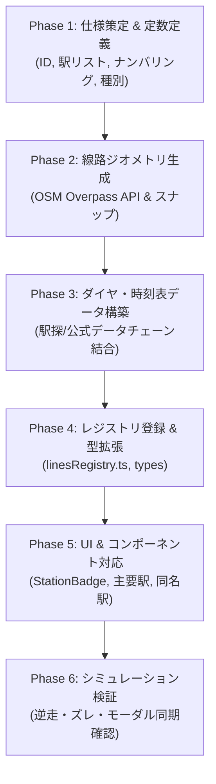

# Trainfo 路線追加完全プレイブック（手順書 & チェックリスト）

本ドキュメントは、Trainfo に新しい路線を追加する際の標準ワークフロー、設計仕様、実装手順、およびハマりどころの防止策をまとめた完全マニュアルです。  
次回予定している**つくばエクスプレス（TX: 首都圏新都市鉄道）**の追加をはじめ、今後のあらゆる路線拡張にそのまま適用できます。

---

## 1. 路線拡張アーキテクチャ概要

Trainfo は、複数事業者の路線が同一マップ・同一シミュレーション基盤上で協調動作するマルチライン構造を採用しています。  
各路線は `src/data/lines/<lineId>/` 配下に自己完結したモジュールとして実装され、`src/data/linesRegistry.ts` に登録することで統合されます。

```text
src/
├── types/index.ts                  # LineId, TrainTypeKey などの型定義
├── data/
│   ├── linesRegistry.ts            # 全路線の集約レジストリ
│   └── lines/
│       └── <lineId>/               # 各路線のデータディレクトリ
│           ├── index.ts            # LineDefinition（路線メタデータ統合）
│           ├── stations.ts         # 駅メタデータ（Station[]）
│           ├── trackGeometry.ts    # 線路幾何データ（TrackSegment[]）
│           ├── trainTypes.ts       # 列車種別設定（TrainTypeConfig）
│           ├── stationTimetables.json # 各駅時刻表（StationTimetableStore）
│           └── globalTimetable.json   # 全列車ダイヤ（TimetableTrip[]）
├── components/
│   ├── Common/Badges.tsx           # 駅ナンバリング・種別バッジ
│   └── Map/TrainMap.tsx            # マップ描画・主要駅定義
└── scripts/                        # データ取得・変換スクリプト群
```

---

## 2. 路線追加の全6フェーズ・ワークフロー



---

### Phase 1: 路線・駅の基本仕様策定

1. **基本メタデータの決定**:
   * `lineId`: 英小文字のスネーク/ケバブケース（例: `tsukuba_express`）
   * `lineColor`: 公式ラインカラー（HEX値）
   * `accentColor`: アクセント/速達種別カラー
   * `defaultBounds`: 初期表示バウンディングボックス（南西 `[lat, lng]`, 北東 `[lat, lng]`）
   * `directionNames`: 上り/下りの方向名（正式名称・短縮名称）

2. **駅メタデータの作成 (`stations.ts`)**:
   * 駅ナンバリング: 事業者公式のプレフィックス（例: `TX-01`）と連番。
   * 乗換路線（`transfers`）、番線表記（`platforms`）、バリアフリー設備（`facilities`）。
   * 停車種別（`stoppingTypes`）: その駅に停車する種別キーの配列。
   * 緯度経度（`lat`, `lng`）: 国土地理院またはOSMの駅ノードから高精度に取得。

3. **種別定義の作成 (`trainTypes.ts`)**:
   * 各種別の表示名、短縮名、背景色（`bgColor`）、文字色（`textColor`）、枠線色（`borderColor`）。

---

### Phase 2: 線路ジオメトリの構築 (`trackGeometry.ts`)

列車が地図上を滑らかに走行するためのポリラインを作成します。

1. **OSM Overpass API による線路データ取得**:
   * 対象路線のリレーション（Relation）またはウェイ（Way）を取得。
2. **駅座標へのスナップ (`snapStation`)**:
   * 各駅の緯度経度に一番近い線路ノードを検出し、駅間セグメントに分割。
   * **注意点**: 複線・複々線・待避線が混在する場合、本線の滑らかな連続線を選択する。
3. **セグメントの出力形式**:
   ```typescript
   export interface TrackSegment {
     fromStationId: string;
     toStationId: string;
     fromName: string;
     toName: string;
     coordinates: [number, number][]; // [lat, lng] の連続配列
   }
   ```

---

### Phase 3: ダイヤ・時刻表データ構築 (`stationTimetables` & `globalTimetable`)

1. **時刻表データの収集**:
   * 平日（`weekday`）および土休日（`holiday`）の全駅時刻表。
   * 駅探スクレイピングや公式オープンデータ（ODPT等）を活用。
2. **列車チェーン結合 (`buildChainedStops`)**:
   * 各列車の始発駅から終着駅までの全駅通過・停車時刻を単一トリップとして結合。
   * 実測データが存在しない駅は、駅間標準所要時間（秒）から自然に補間。
   * 通過駅は `isPassing: true` とし、通過予測時刻を付与。
3. **方向・列車番号の判定**:
   * 下り（奇数等）と上り（偶数等）の列車番号ルールを正確にパース。
   * 出力: `stationTimetables.json`（各駅発車標）と `globalTimetable.json`（全列車トリップ）。

---

### Phase 4: レジストリ登録 & 型拡張

1. **`src/types/index.ts`**:
   * `LineId` 共用体に新しい路線IDを追加。
     ```typescript
     export type LineId = 'tojo' | 'saikyo' | 'musashino' | 'tsukuba_express';
     ```
   * 必要に応じて `TrainTypeKey` に新路線の固有種別を追加。
2. **`src/data/lines/<lineId>/index.ts`**:
   * `LineDefinition` オブジェクトをエクスポート。
3. **`src/data/linesRegistry.ts`**:
   * `LINES_REGISTRY` に新路線を追加。

---

### Phase 5: UI & コンポーネント対応

1. **駅ナンバリングバッジの配色追加 (`Badges.tsx`)**:
   * `STATION_BADGE_COLORS` に新路線のプレフィックス（TX等）を登録。
2. **主要駅ハイライト登録 (`TrainMap.tsx`)**:
   * 地図の縮尺に応じた駅名表示やマーカー強調のため、主要駅ID（ターミナル駅、快速停車駅、乗換駅）を `isMajor` 配列に追加。
3. **他路線との同名駅リンク (`StationDetail.tsx`)**:
   * 駅名（`station.name`）が一致する駅同士は自動的に相互切り替えボタンが表示されるため、駅名の表記揺れがないか確認（例: 「流山おおたかの森」「南流山」など）。

---

### Phase 6: シミュレーション検証 & テスト

* [ ] `npm run build` を実行し、TypeScriptの型エラーやJSONパースエラーがゼロであることを確認。
* [ ] 列車シミュレータを起動し、早送り（10x/30x）で以下の挙動をチェック：
  * 列車の瞬間移動や不自然なジャンプがないか。
  * 駅間で急激なUターン（行って帰る挙動）が発生していないか。
  * 始発駅での発車、終着駅での消滅がスムーズに行われるか。
* [ ] 駅発車標モーダル（TimetableModal）を開き、発車時刻・行先・種別が正常に並んでいるか確認。
* [ ] 列車詳細サイドバー（TrainDetail）を開き、全停車駅・通過駅が正しい順序で表示されるか確認。

---

## 3. 武蔵野線実装から得られた重要な教訓・ハマりどころ防止策

### 1. 駅ナンバリングプレフィックスのハードコード問題
* **事象**: `StationBadge` が特定路線の2択分岐（`JA` か否か）になっていたため、新路線のバッジが別路線のカラー（東上線の青/オレンジ）で表示されてしまった。
* **防止策**: 必ず `STATION_BADGE_COLORS` のマッピングオブジェクトに新路線のプレフィックス（例: `TX`）を明示的に登録すること。

### 2. 乗り入れ駅・直通駅の駅ナンバリング実態の確認（大宮駅問題）
* **事象**: 大宮駅地上ホーム発着のむさしの号・しもうさ号に対して、埼京線地下ホームの記号 `JA-26` を流用してしまい、実態と乖離した。
* **防止策**: 
  * 直通区間や他社線接続駅では、**「その列車が実際に発着するホームの所属路線ナンバリング」**を採用する。
  * TXの場合は全線自社完結のため直通問題は発生しないが、他社線との乗換駅（北千住、秋葉原、南流山等）ではTX公式ナンバリング（`TX-01`〜`TX-20`）で統一する。

### 3. 駅間所要時間と時刻表の秒単位ズレ（12分ズレ問題）
* **事象**: 途中駅の時刻を固定の間隔（例: 均等3分）で補完したため、実際の駅探時刻表と累積12分ものズレが生じた。
* **防止策**: 
  * 駅探等の各駅発車時刻データ（`sec`）を優先してトリップの `stops` に直接マッピングする。
  * 欠損駅のみ `SEGMENT_DURATIONS`（駅間実測所要時間）でチェーン補間する。

### 4. 線路ポリラインのノード順序と逆走
* **事象**: OSMの線路ウェイが逆向きに連結されていたため、列車が駅の手前で逆走して戻る挙動が発生した。
* **防止策**: 
  * 線路生成スクリプトで、始点から終点へ向けて距離（`dist`）が単調増加するようにソート・整流化する。

---

## 4. 次回：つくばエクスプレス（TX）実装設計シート

つくばエクスプレスは全20駅、踏切ゼロの全線高架・地下構造、自社線内完結ダイヤのため、非常に整然としたデータ設計が可能です。

### 4.1 基本仕様
* **路線ID**: `tsukuba_express`
* **正式名称**: 首都圏新都市鉄道つくばエクスプレス
* **短縮名称**: つくばエクスプレス（TX）
* **運行会社**: 首都圏新都市鉄道 (MIR)
* **ラインカラー**: `#003893`（TXディープブルー）
* **アクセントカラー**: `#df0011`（TXレッド）
* **デフォルトBounds**: 南西 `[35.690, 139.770]`（秋葉原）、北東 `[36.085, 140.110]`（つくば）
* **方向名**:
  * 上り（inbound）: 秋葉原方面
  * 下り（outbound）: つくば方面

### 4.2 駅一覧定義（全20駅）
| ID | 駅番号 | 駅名 | 読み | 快速 | 区快 | 通快 | 普通 | 備考・乗換 |
|:---|:---:|:---|:---|:---:|:---:|:---:|:---:|:---|
| `TX-01` | 1 | 秋葉原 | あきはばら | ● | ● | ● | ● | JR各線・東京メトロ日比谷線 |
| `TX-02` | 2 | 新御徒町 | しんおかちまち | ● | ● | ● | ● | 都営大江戸線 |
| `TX-03` | 3 | 浅草 | あさくさ | ● | ● | ● | ● | 東京メトロ銀座線・東武・都営 |
| `TX-04` | 4 | 南千住 | みなみせんじゅ | ● | ● | ● | ● | JR常磐線・東京メトロ日比谷線 |
| `TX-05` | 5 | 北千住 | きたせんじゅ | ● | ● | ● | ● | JR常磐線・東京メトロ・東武 |
| `TX-06` | 6 | 青井 | あおい | ｜ | ｜ | ｜ | ● | |
| `TX-07` | 7 | 六町 | ろくちょう | ｜ | △ | ● | ● | 通快停車駅（※区快は平日朝上りの一部停車） |
| `TX-08` | 8 | 八潮 | やしお | ● | ● | ● | ● | **2024年改正で快速停車駅追加**・待避可能駅 |
| `TX-09` | 9 | 三郷中央 | みさとちゅうおう | ｜ | ● | ｜ | ● | |
| `TX-10` | 10 | 南流山 | みなみながれやま | ● | ● | ● | ● | **JR武蔵野線（JM-16）乗換・同名駅** |
| `TX-11` | 11 | 流山セントラルパーク | ながれやまぜんとらるぱーく | ｜ | ｜ | ｜ | ● | |
| `TX-12` | 12 | 流山おおたかの森 | ながれやまおおたかのもり | ● | ● | ● | ● | 東武アーバンパークライン・待避可能駅 |
| `TX-13` | 13 | 柏の葉キャンパス | かしわのはきゃんぱす | ｜ | ● | ● | ● | |
| `TX-14` | 14 | 柏たなか | かしわたなか | ｜ | ｜ | ｜ | ● | |
| `TX-15` | 15 | 守谷 | もりや | ● | ● | ● | ● | 関東鉄道常総線・車両基地・待避可能駅 |
| `TX-16` | 16 | みらい平 | みらいだいら | ｜ | ● | ｜ | ● | |
| `TX-17` | 17 | みどりの | みどりの | ｜ | ● | ｜ | ● | |
| `TX-18` | 18 | 万博記念公園 | ばんぱくきねんこうえん | ｜ | ● | ｜ | ● | |
| `TX-19` | 19 | 研究学園 | けんきゅうがくえん | ｜ | ● | ● | ● | |
| `TX-20` | 20 | つくば | つくば | ● | ● | ● | ● | 終点 |

### 4.3 列車種別定義 (`trainTypes.ts`)
1. **普通 (Local)**:
   * キー: `local`
   * 表示名: 普通 / Local
   * 色: `#334155`（スレートグレー）または `#003893`
2. **区間快速 (Semi-Rapid)**:
   * キー: `semi_rapid`
   * 表示名: 区間快速 / Semi-Rapid / 短縮: 区快
   * 色: `#0099d8`（TXスカイブルー）
3. **通勤快速 (Commuter Rapid)**:
   * キー: `commuter_rapid`
   * 表示名: 通勤快速 / Commuter Rapid / 短縮: 通快
   * 色: `#ea5504`（TXオレンジ）
4. **快速 (Rapid)**:
   * キー: `rapid`
   * 表示名: 快速 / Rapid / 短縮: 快速
   * 色: `#df0011`（TXスカーレットレッド）

### 4.4 つくばエクスプレス追加時の事前準備コマンド
```powershell
# 1. ブランチ作成
git checkout master
git pull origin master
git checkout -b feat/MIR/TsukubaExpress

# 2. ディレクトリ作成
mkdir src/data/lines/tsukuba_express
```
