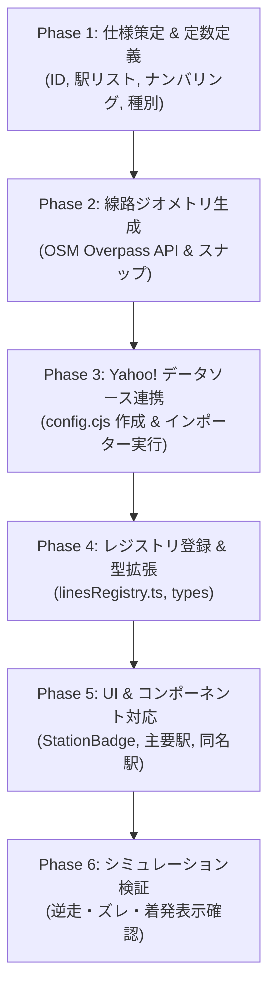

# Trainfo 路線追加完全プレイブック（標準手順書 & チェックリスト）

本ドキュメントは、Trainfo に新しい路線を追加する際の標準ワークフロー、データ構造、実装手順、およびハマりどころの防止策をまとめた完全マニュアルです。  
これまでの**東武東上線**、**JR埼京線・川越線**、**JR武蔵野線**、および**首都圏新都市鉄道つくばエクスプレス（TX）**の実装、ならびに**Yahoo! 乗換案内データソース共通基盤**への完全移行で培われた知見を集約しています。

---

## 1. 路線拡張アーキテクチャ概要

Trainfo は、複数事業者の路線が同一マップ・同一シミュレーション基盤上で協調動作するマルチライン構造を採用しています。  
各路線は `src/data/lines/<lineId>/` 配下に自己完結したモジュールとして実装され、`src/data/linesRegistry.ts` に登録することで統合されます。  
また、時刻表・ダイヤ生成パイプラインは `scripts/common/yahoo/` の汎用基盤により、路線ごとの設定ファイル（`scripts/lines/<lineId>/config.cjs`）のみで完結します。

```text
Trainfo/
├── docs/
│   └── ROUTE_EXPANSION_PLAYBOOK.md     # 本手順書
├── scripts/
│   ├── runYahooImporter.cjs            # Yahoo! 乗換案内 共通インポーター CLI
│   ├── common/
│   │   └── yahoo/                      # 共通データ生成基盤
│   │       ├── YahooClient.cjs         # HTTPクライアント & キャッシュ制御
│   │       ├── YahooStationTimetableScraper.cjs # 駅時刻表スクレイパー
│   │       ├── YahooTrainDetailScraper.cjs     # 列車詳細（着発時刻）スクレイパー
│   │       └── YahooTimetableBuilder.cjs       # ダイヤ合成 & 汎用通過・秒補間
│   └── lines/
│       └── <lineId>/
│           └── config.cjs              # 路線固有のスクレイパー・ダイヤ設定
├── src/
│   ├── types/index.ts                  # LineId, TrainTypeKey などの型定義
│   ├── data/
│   │   ├── linesRegistry.ts            # 全路線の集約レジストリ
│   │   └── lines/
│   │       └── <lineId>/               # 各路線のデータモジュール
│   │           ├── index.ts            # LineDefinition（路線メタデータ統合）
│   │           ├── stations.ts         # 駅メタデータ（Station[]）
│   │           ├── trackGeometry.ts    # 線路幾何データ（TrackSegment[]）
│   │           ├── trainTypes.ts       # 列車種別設定（TrainTypeConfig）
│   │           ├── stationTimetables.json # 各駅時刻表（StationTimetableStore）
│   │           └── globalTimetable.json   # 全列車ダイヤ（TimetableTrip[]）
│   └── components/
│       ├── Common/Badges.tsx           # 駅ナンバリング・種別バッジ
│       └── Map/TrainMap.tsx            # マップ描画・主要駅定義
```

---

## 2. 路線追加の全6フェーズ・ワークフロー



---

### Phase 1: 路線・駅の基本仕様策定

1. **基本メタデータの決定**:
   * `lineId`: 英小文字のスネークケース（例: `tsukuba_express`, `keihin_tohoku`, `yurakucho`）
   * `lineColor`: 公式ラインカラー（HEX値）
   * `accentColor`: アクセント/速達種別カラー
   * `defaultBounds`: 初期表示バウンディングボックス（南西 `[lat, lng]`, 北東 `[lat, lng]`）
   * `directionNames`: 上り/下りの方向名（正式名称・短縮名称）

2. **駅メタデータの作成 (`stations.ts`)**:
   * 駅ナンバリング: 公式プレフィックス（例: `TX-01`）と連番。
   * 乗換路線（`transfers`）、番線表記（`platforms`）、バリアフリー設備（`facilities`）。
   * 停車種別（`stoppingTypes`）: **【重要】各駅に停車する種別キーの配列を正確に定義。これがダイヤ補間における通過・停車の Single Source of Truth となります。**
   * 緯度経度（`lat`, `lng`）: 国土地理院またはOSMの駅ノードから高精度に取得。

3. **種別定義の作成 (`trainTypes.ts`)**:
   * 各種別の表示名、短縮名、背景色（`bgColor`）、文字色（`textColor`）、枠線色（`borderColor`）。

---

### Phase 2: 線路ジオメトリの構築 (`trackGeometry.ts`)

列車が地図上を滑らかに走行するためのポリラインを作成します。

1. **OSM Overpass API による線路データ取得**:
   * 対象路線のリレーション（Relation）またはウェイ（Way）を取得。
   * Overpass Turbo クエリ例:
     ```overpassql
     [out:json][timeout:60];
     relation["route"="train"]["name"~"つくばエクスプレス"];
     (._;>>;);
     out body;
     ```
2. **駅座標へのスナップ (`snapStation`)**:
   * 各駅の緯度経度に一番近い線路ノードを検出し、駅間セグメントに分割。
   * **注意点**: 複線・複々線・待避線が混在する場合、本線の滑らかな連続線を選択する。
3. **セグメントの出力形式**:
   ```typescript
   export interface TrackSegment {
     fromStationId: string;
     toStationId: string;
     fromName: string;
     toName: string;
     coordinates: [number, number][]; // [lat, lng] の連続配列
   }
   ```

---

### Phase 3: Yahoo! データソース連携 & ダイヤ生成 (`scripts/common/yahoo/`)

Trainfo では、高精度な「**Yahoo! 乗換案内（路線情報）データソース共通基盤**」を標準採用しています。  
駅探方式の課題であった「終着駅の到着時刻欠落」や「途中駅待避・緩急接続での長時間停車（着時刻と発時刻の差）」を完全な実データとして取得可能です。

#### 1. 路線設定ファイルの作成 (`scripts/lines/<lineId>/config.cjs`)
新規路線用の設定ファイルを1つ作成するだけで、ダイヤ生成の準備が完了します。

```javascript
// scripts/lines/<lineId>/config.cjs
module.exports = {
  lineId: 'tsukuba_express',
  name: '首都圏新都市鉄道つくばエクスプレス',
  stationsFilePath: 'src/data/lines/tsukuba_express/stations.ts',
  outputPaths: {
    stationTimetables: 'src/data/lines/tsukuba_express/stationTimetables.json',
    globalTimetable: 'src/data/lines/tsukuba_express/globalTimetable.json',
  },
  // Yahoo! 路線情報における駅IDと上り/下りのグループID
  stations: [
    { id: 'TX-01', name: '秋葉原', yahooStationId: '22492', inGroupId: null, outGroupId: '6921' },
    { id: 'TX-02', name: '新御徒町', yahooStationId: '29336', inGroupId: '6920', outGroupId: '6921' },
    // ...
    { id: 'TX-20', name: 'つくば', yahooStationId: '29410', inGroupId: '6920', outGroupId: null },
  ],
  // 駅名表記ゆれの正規化
  stationNameAliases: {
    '浅草(ＴＸ)': '浅草',
    '万博記念公園(茨城県)': '万博記念公園',
  },
  // Yahoo! 種別名から TrainTypeKey へのマッピング
  trainTypeMap: {
    '普通': 'local',
    '区間快速': 'semi_rapid',
    '通勤快速': 'commuter_rapid',
    '快速': 'rapid',
    '特急': 'limitedExp',
  },
  defaultCars: 6,
  // 通過駅の秒補間用 基準駅間秒数
  baseSectionSeconds: {
    1: 120, // TX-01 -> TX-02
    2: 120, // TX-02 -> TX-03
    // ...
  },
  // 【オプション】分岐直通路線用設定（武蔵野線など）
  // directStops: true, // 停車駅リストを直接トリップのstopsとして使用
  // buildStationTimetablesFromTrips: true, // トリップから駅発車標を集約
  // junctionPassingRules: [{ fromId: 'JU-07', toId: 'JM-25', viaIds: ['JM-26'] }],
};
```

> **Yahoo! IDの調べ方**:
> 1. `https://transit.yahoo.co.jp/timetable/` で対象路線の駅時刻表ページを開く。
> 2. URL 例: `https://transit.yahoo.co.jp/timetable/22492/6921?kind=1`
>    - `22492` が `yahooStationId`
>    - `6921` が その方向（下り等）のグループID（`outGroupId`）
>    - 逆方向ページの `6920` が上りのグループID（`inGroupId`）

#### 2. インポーター CLI の実行
```bash
node scripts/runYahooImporter.cjs --line <lineId>
```

**パイプラインの自動実行ステップ**:
1. **Step 1: 駅時刻表スクレイピング**: 全駅の平日（`kind=1`）・土休日（`kind=4`）発車標を収集し `stationTimetables.json` を出力。
2. **Step 2: 列車詳細スクレイピング**: ユニーク列車（`${dayKey}_${trainId}`）の詳細ページから全停車駅の**着時刻・発時刻・終着駅着時刻**を完全収集。
3. **Step 3: ダイヤ合成 & 汎用通過・秒補間**: `stations.ts` の `stoppingTypes` を参照して通過駅を自動特定し、停車/通過を考慮した線形秒補間を行って `globalTimetable.json` を生成。

---

### Phase 4: レジストリ登録 & 型拡張

1. **`src/types/index.ts`**:
   * `LineId` 共用体に新しい路線IDを追加。
     ```typescript
     export type LineId = 'tojo' | 'saikyo' | 'musashino' | 'tsukuba_express';
     ```
   * 必要に応じて `TrainTypeKey` に新路線の固有種別を追加。
2. **`src/data/lines/<lineId>/index.ts`**:
   * `LineDefinition` オブジェクトをエクスポート。
3. **`src/data/linesRegistry.ts`**:
   * `LINES_REGISTRY` に新路線を追加。

---

### Phase 5: UI & コンポーネント対応

1. **駅ナンバリングバッジの配色追加 ([`Badges.tsx`](file:///c:/Users/Genbu/GitHub/github.com/GenbuHase/Trainfo/src/components/Common/Badges.tsx))**:
   * `STATION_BADGE_COLORS` に新路線のプレフィックス（TX等）を登録。
     ```typescript
     TX: {
       borderColor: '#003893',
       prefixColor: '#df0011',
       numColor: '#003893',
     },
     ```
2. **主要駅ハイライト登録 ([`TrainMap.tsx`](file:///c:/Users/Genbu/GitHub/github.com/GenbuHase/Trainfo/src/components/Map/TrainMap.tsx))**:
   * ズームアウト時にも駅名を表示する主要駅ID（ターミナル駅、快速停車駅、乗換駅）を `isMajor` 配列に追加。
3. **他路線との同名駅リンク ([`StationDetail.tsx`](file:///c:/Users/Genbu/GitHub/github.com/GenbuHase/Trainfo/src/components/Sidebar/StationDetail.tsx))**:
   * 駅名（`station.name`）が一致する駅同士は自動的に相互切り替えボタンが表示されます。
   * 乗換駅の駅名表記揺れがないか確認（例: 武蔵野線とTXの「南流山」など）。

---

### Phase 6: シミュレーション検証 & テスト

* [ ] `npm run build` を実行し、TypeScriptの型エラーやJSONパースエラーがゼロであることを確認。
* [ ] 列車シミュレータを起動し、早送り（10x/30x）で以下の挙動をチェック：
  * 列車の瞬間移動や不自然なジャンプがないか。
  * 駅間で急激なUターン（行って帰る挙動）が発生していないか。
  * 始発駅での発車、終着駅での消滅がスムーズに行われるか。
* [ ] 駅発車標モーダル（TimetableModal）を開き、発車時刻・行先・種別が正常に並んでいるか確認。
* [ ] 列車詳細サイドバー（TrainDetail）を開き、停車駅一覧が「〇〇:〇〇着」「〇〇:〇〇発」の2段組で正しく表示されるか確認。

---

## 3. 重要教訓・ハマりどころ防止策（設計標準）

> [!IMPORTANT]
> 過去の実装およびYahoo!データ移行で解決された以下の知見を必ず遵守してください。

### 1. ダイヤ補間における stoppingTypes 駆動（Single Source of Truth）
* **事象**: 速達列車（快速や急行）の補間ロジック内に駅番号や停車ルールを個別ハードコードすると、路線拡張時やダイヤ改正時に不整合・保守不能が発生する。
* **防止策**: 停車/通過判定は必ず `stations.ts` の `station.stoppingTypes.includes(trainType)` のみで行う。

### 2. Yahoo! 路線情報における平日/休日列車ID衝突の回避
* **事象**: Yahoo! の内部データにおいて、平日（`kind=1`）と土休日（`kind=4`）で同一の `trainId`（例: `44618`）が再利用される場合がある。
* **防止策**: ユニーク列車キーおよびキャッシュファイル名は必ず **`${dayKey}_${trainId}`**（複合キー）で管理する。

### 3. 種別解決の最長一致スキャン（Longest-Match Scan）
* **事象**: 「普通 むさしの号」を単純な部分一致で判定すると、「普通」に誤判定されて「むさしの号」固有の設定が失われる。
* **防止策**: 種別名のマッチングはキー文字列の長さが長い順（降順）に走査し、より具体的な種別名を優先して解決する。

### 4. 直通先種別の自社線内フォールバック
* **事象**: 東武東上線に乗り入れる地下鉄直通列車（副都心線内「通勤急行」等）が、東上線内の各駅停車区間で「通過」と誤認される。
* **防止策**: 路線定義に存在しない他社線種別が渡された場合、あるいは自社線内で全駅停車となる区間では、安全に自社線内の標準種別（`local` 等）へフォールバックさせる。

### 5. 短絡線・特急・臨時列車の通過駅補間 (`junctionPassingRules` / `directStops`)
* **事象**: 武蔵野線の大宮支線（大宮 ↔ 武蔵浦和/南浦和）や貨物線経由の特急（鎌倉号、川越号等）で、中間の信号場や短絡線の線路セグメントが飛び越えられ、列車がワープする。
* **防止策**: 
  * 停車駅リストに存在しないが物理的に経由する駅（例: 大宮から南浦和へ向かう際の武蔵浦和）を `junctionPassingRules` で通過駅（`isPassing: true`）として中間補間する。
  * 特殊直通路線では `directStops: true` を指定し、実停車駅シーケンスから線路追従トリップを組み立てる。

### 6. 発着番線と駅ナンバリングの実態整合（大宮駅問題）
* **事象**: 同一駅名であっても発着ホームが異なる場合（大宮駅地上ホーム発着のむさしの号・しもうさ号に対して埼京線地下ホーム `JA-26` を流用したケース）、ナンバリングや案内が実態と乖離する。
* **防止策**: 列車が実際に発着するホームの所属路線ナンバリング（大宮地上ホームなら `JU-07`）を採用する。

### 7. 直通列車の路線間重複防止と所属路線の集約（むさしの号問題）
* **事象**: 複数路線を跨ぐ直通系統（大宮〜武蔵野線〜中央線・八王子を直通する「むさしの号」など）において、乗り入れ先路線（中央線）の駅時刻表スクレイピング時に当該列車が短縮区間（八王子〜国立）として重複収集され、両路線で同一列車が二重シミュレーションされる。
* **防止策**:
  * 乗り入れ元（全線通し運行する路線: 武蔵野線側）に列車責務を集約（Single Source of Truth）。
  * 乗り入れ先（中央線側）の `config.cjs` に `shouldExcludeDeparture` および `shouldExcludeTrip` を定義し、発車標およびダイヤトリップから当該系統（列車名・行先・列車番号）をクリーンに除外する。

---

## 4. 新路線追加用 設定ファイル・テンプレート

新規路線を追加する際は、以下のひな型をコピーして `scripts/lines/<lineId>/config.cjs` を作成してください。

```javascript
// scripts/lines/<lineId>/config.cjs
module.exports = {
  lineId: '<lineId>',
  name: '<正式路線名>',
  stationsFilePath: 'src/data/lines/<lineId>/stations.ts',
  outputPaths: {
    stationTimetables: 'src/data/lines/<lineId>/stationTimetables.json',
    globalTimetable: 'src/data/lines/<lineId>/globalTimetable.json',
  },
  stations: [
    // Yahoo! 路線情報の各駅ID・グループIDを記述
    { id: '<PREFIX>-01', name: '<駅名1>', yahooStationId: 'xxxxx', inGroupId: null, outGroupId: 'yyyy' },
    { id: '<PREFIX>-02', name: '<駅名2>', yahooStationId: 'xxxxx', inGroupId: 'zzzz', outGroupId: 'yyyy' },
  ],
  stationNameAliases: {
    // Yahoo! 特有の駅名（例: "駅名(都道府県)"）の表記ゆれ吸収
  },
  trainTypeMap: {
    '普通': 'local',
    '各駅停車': 'local',
    '快速': 'rapid',
    '急行': 'express',
  },
  defaultCars: 10,
  baseSectionSeconds: {
    // 駅間標準秒数（1: 駅1->駅2, 2: 駅2->駅3, ...）
    1: 120,
    2: 180,
  },
};
```
